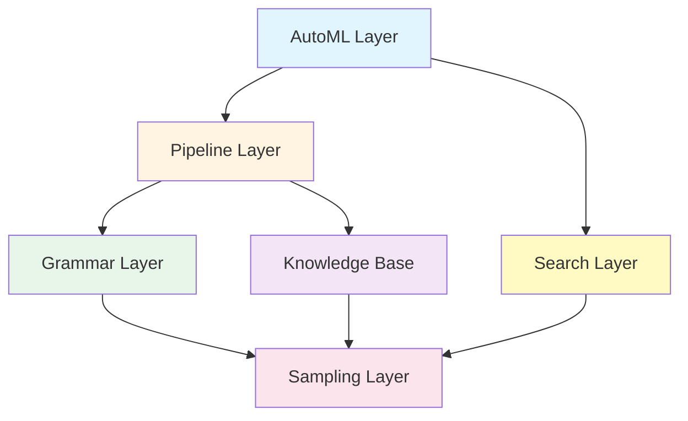
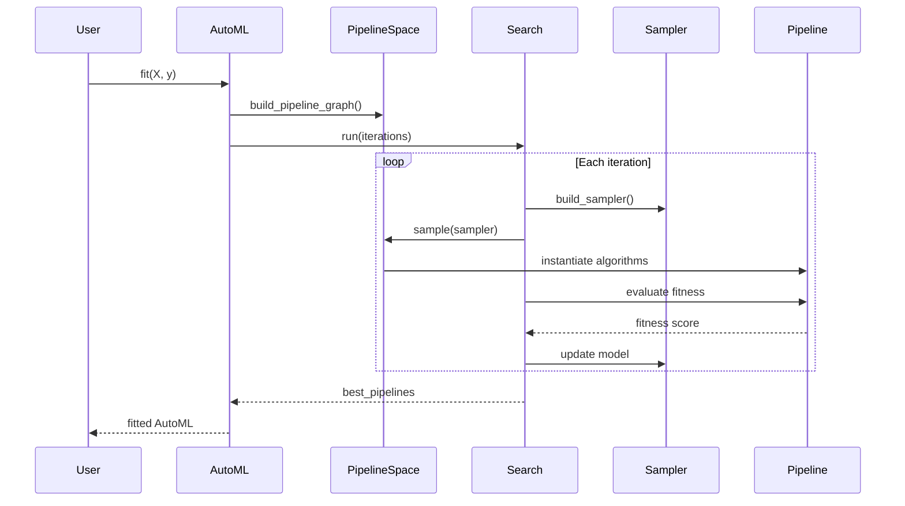

AutoGOAL is built on a layered architecture that separates concerns and enables flexible AutoML pipeline generation. This page explains how the major components fit together to enable automatic optimization, generation, and learning of software pipelines.

## High-Level Architecture

AutoGOAL's architecture consists of four core layers that work together:



<CardGroup cols={2}>
  <Card title="Grammar Layer" icon="code">
    Defines search spaces using context-free grammars and graph grammars for generating algorithm configurations
  </Card>
  <Card title="Knowledge Base" icon="database">
    Provides semantic type system and algorithm registry for intelligent pipeline composition
  </Card>
  <Card title="Search Layer" icon="magnifying-glass">
    Implements optimization strategies including random search, probabilistic estimation, and neural methods
  </Card>
  <Card title="Sampling Layer" icon="shuffle">
    Handles parameter sampling with support for probabilistic models and replay capabilities
  </Card>
</CardGroup>

## Core Components

### 1. Grammar System

The grammar system (`autogoal.grammar`) enables definition of complex search spaces:

**Context-Free Grammars (CFG)**

Used to generate algorithm instances with configurable parameters:

```python
from autogoal.grammar import generate_cfg, DiscreteValue, ContinuousValue

class MyClassifier:
    def __init__(self, 
                 n_estimators: DiscreteValue(10, 100),
                 learning_rate: ContinuousValue(0.01, 0.5)):
        self.n_estimators = n_estimators
        self.learning_rate = learning_rate

# Generate grammar from class annotations
grammar = generate_cfg(MyClassifier)
print(grammar)
# Output:
# <MyClassifier>              := MyClassifier (n_estimators=<MyClassifier_n_estimators>, learning_rate=<MyClassifier_learning_rate>)
# <MyClassifier_n_estimators> := discrete (min=10, max=100)
# <MyClassifier_learning_rate>:= continuous (min=0.01, max=0.5)
```

**Graph Grammars**

Used to generate pipeline structures as directed acyclic graphs:

```python
from autogoal.grammar import GraphGrammar, Path, Block

# Define a grammar for pipeline generation
grammar = GraphGrammar(start='Pipeline')
grammar.add('Pipeline', Path('Preprocessing', 'Model'))
grammar.add('Preprocessing', Block('Scaler', 'Selector'))
```

See [Search Spaces](/concepts/search-spaces) for details.

### 2. Knowledge Base (KB)

The knowledge base (`autogoal.kb`) provides:

**Semantic Types**

A type hierarchy for describing data semantics:

```python
from autogoal.kb import (
    MatrixContinuousDense,  # Numeric matrix
    Seq, Sentence, Word,     # Text types
    VectorCategorical        # Categorical labels
)

# Type specialization
ListOfSentences = Seq[Sentence]  # Sequence of sentences
ListOfWords = Seq[Word]           # Sequence of words

# Type checking
issubclass(Seq[Word], Seq[Sentence])  # True - words are sentences
issubclass(Seq[Sentence], Seq[Word])  # False
```

**Algorithm Abstraction**

Base classes for defining algorithms with semantic annotations:

```python
from autogoal.kb import AlgorithmBase
from autogoal.kb import MatrixContinuousDense, VectorCategorical

class MyAlgorithm(AlgorithmBase):
    def run(self, 
            X: MatrixContinuousDense, 
            y: VectorCategorical) -> VectorCategorical:
        # Algorithm implementation
        return predictions

# AutoGOAL can introspect input/output types
MyAlgorithm.input_types()   # (MatrixContinuousDense, VectorCategorical)
MyAlgorithm.output_type()   # VectorCategorical
```

See [Semantic Types](/concepts/semantic-types) for details.

### 3. Pipeline System

The pipeline system (`autogoal.kb.Pipeline`) enables automatic composition:

**Pipeline Graph Construction**

```python
from autogoal.kb import build_pipeline_graph, MatrixContinuousDense, VectorCategorical

# Define input/output types
input_types = [MatrixContinuousDense, VectorCategorical]
output_type = VectorCategorical

# Build graph of compatible algorithms
pipeline_space = build_pipeline_graph(
    input_types=input_types,
    output_type=output_type,
    registry=algorithms  # List of algorithm classes
)
```

The system automatically:
- Identifies compatible algorithms based on semantic types
- Constructs a directed graph of valid transitions
- Generates only feasible pipelines

**Pipeline Execution**

```python
# Sample a pipeline from the space
pipeline = pipeline_space.sample()

# Execute pipeline
result = pipeline.run(X_train, y_train)
```

See [Pipelines](/concepts/pipelines) for details.

### 4. Sampling System

The sampling layer (`autogoal.sampling`) provides:

**Basic Sampling**

```python
from autogoal.sampling import Sampler

sampler = Sampler(random_state=42)
value = sampler.discrete(min=1, max=10)
option = sampler.categorical(['A', 'B', 'C'])
```

**Model-Based Sampling**

Learns probability distributions from successful solutions:

```python
from autogoal.sampling import ModelSampler

# Initialize with probabilistic model
sampler = ModelSampler(model={})

# Sample with handle for tracking
value = sampler.discrete(min=1, max=10, handle='n_estimators')

# Access updates for model learning
updates = sampler.updates  # {'n_estimators': [value]}
```

**Replay Sampling**

Records and replays sampling decisions:

```python
from autogoal.sampling import ReplaySampler

sampler = ReplaySampler(Sampler(random_state=42))
values = [sampler.discrete(0, 10) for _ in range(5)]

# Replay same values
sampler.replay()
replayed = [sampler.discrete(0, 10) for _ in range(5)]
assert values == replayed
```

### 5. Search Strategies

The search layer (`autogoal.search`) implements optimization:

**Base Search Algorithm**

All search strategies inherit from `SearchAlgorithm`:

```python
from autogoal.search import SearchAlgorithm

class CustomSearch(SearchAlgorithm):
    def _build_sampler(self):
        # Return sampler for generating solutions
        return Sampler()
    
    def _finish_generation(self, fitness_values):
        # Update internal state based on fitness
        pass
```

**Available Strategies**

<Steps>
  <Step title="RandomSearch">
    Uniform random sampling without learning
  </Step>
  <Step title="PESearch (Probabilistic Estimation)">
    Learns probabilistic model from best solutions
  </Step>
  <Step title="SurrogateSearch">
    Uses surrogate models to predict solution quality
  </Step>
  <Step title="NSPESearch">
    Multi-objective non-dominated sorting with probabilistic estimation
  </Step>
</Steps>

See [Optimization](/concepts/optimization) for details.

### 6. AutoML Interface

The `AutoML` class (`autogoal.ml.AutoML`) provides the high-level API:

```python
from autogoal.ml import AutoML

# Initialize AutoML
automl = AutoML(
    input=MatrixContinuousDense,
    output=VectorCategorical,
    search_algorithm=PESearch,
    search_iterations=100
)

# Fit on data - automatically builds pipeline graph and searches
automl.fit(X_train, y_train)

# Use best pipeline
predictions = automl.predict(X_test)
```

## Data Flow

Here's how data flows through AutoGOAL during optimization:



<Steps>
  <Step title="Initialization">
    User calls `fit()` with training data. AutoML infers semantic types and builds pipeline space.
  </Step>
  
  <Step title="Search Loop">
    Search algorithm generates solutions by sampling from the pipeline space using learned probability distributions.
  </Step>
  
  <Step title="Evaluation">
    Each sampled pipeline is evaluated on the training data with cross-validation.
  </Step>
  
  <Step title="Learning">
    Search algorithm updates its internal model based on which solutions performed best.
  </Step>
  
  <Step title="Convergence">
    Process repeats until time/iteration budget is exhausted or target performance is reached.
  </Step>
</Steps>

## Key Design Principles

### Separation of Concerns

Each layer has a specific responsibility:

- **Grammar**: Structure of search space
- **Knowledge Base**: Semantic compatibility
- **Search**: Optimization strategy
- **Sampling**: Randomness and learning

### Composability

Components can be mixed and matched:

```python
from autogoal.search import PESearch
from autogoal.grammar import generate_cfg
from autogoal.sampling import ModelSampler

# Use CFG with custom search
grammar = generate_cfg(MyClass)
search = PESearch(grammar, fitness_fn, ...)
```

### Extensibility

<Note>
Every major component is extensible through inheritance:
- Add custom search algorithms by inheriting from `SearchAlgorithm`
- Define custom semantic types by inheriting from `SemanticType`
- Create custom algorithms by inheriting from `AlgorithmBase`
</Note>

## Module Organization

AutoGOAL's source code is organized as follows:

```
autogoal/
├── grammar/           # Grammar definitions (CFG, Graph)
│   ├── _base.py      # Base Grammar class
│   ├── _cfg.py       # Context-free grammar
│   └── _graph.py     # Graph grammar
├── kb/               # Knowledge base
│   ├── _algorithm.py # Algorithm base classes
│   ├── _semantics.py # Semantic type system
│   └── _data.py      # Data type utilities
├── search/           # Search strategies
│   ├── _base.py      # Base SearchAlgorithm
│   ├── _random.py    # Random search
│   ├── _pge.py       # Probabilistic estimation
│   └── _learning.py  # Surrogate-based search
├── sampling/         # Sampling utilities
│   └── __init__.py   # Sampler classes
├── ml/               # High-level AutoML API
│   ├── _automl.py    # AutoML class
│   └── metrics.py    # Evaluation metrics
└── utils/            # Shared utilities
```

## Next Steps

<CardGroup cols={2}>
  <Card title="Pipelines" icon="diagram-project" href="/concepts/pipelines">
    Learn how AutoGOAL composes algorithms into pipelines
  </Card>
  <Card title="Search Spaces" icon="cube" href="/concepts/search-spaces">
    Understand grammar-based search space definition
  </Card>
  <Card title="Semantic Types" icon="tags" href="/concepts/semantic-types">
    Explore the type system for algorithm composition
  </Card>
  <Card title="Optimization" icon="chart-line" href="/concepts/optimization">
    Dive into search algorithms and optimization strategies
  </Card>
</CardGroup>
