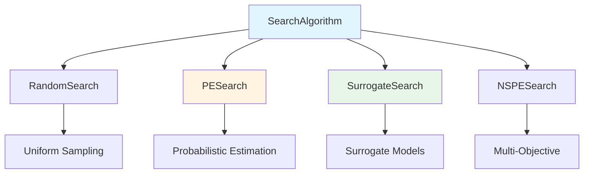
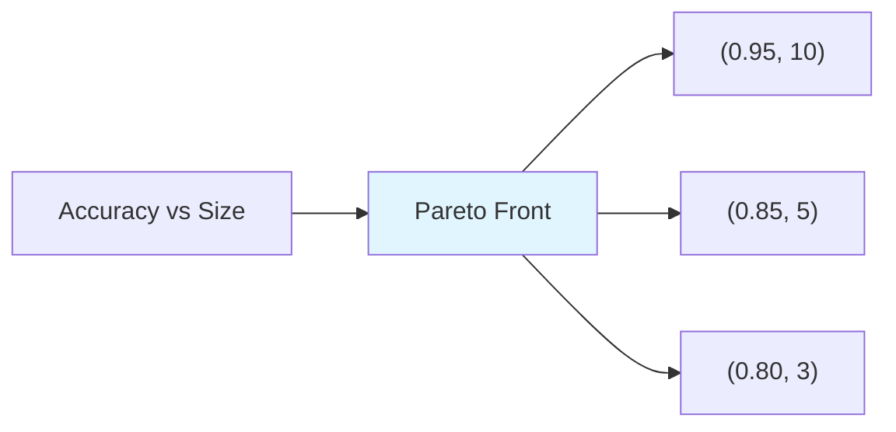

AutoGOAL provides several search algorithms for exploring pipeline spaces and finding optimal configurations. This page explains the available optimization strategies, how they work, and when to use each one.

## Search Algorithm Architecture

All search algorithms in AutoGOAL inherit from the base `SearchAlgorithm` class:



### Base SearchAlgorithm

The `SearchAlgorithm` class (from `autogoal/search/_base.py:22`) provides the optimization framework:

```python
from autogoal.search import SearchAlgorithm

class SearchAlgorithm:
    def __init__(self,
                 generator_fn,           # Function to generate solutions
                 fitness_fn,             # Function to evaluate solutions
                 pop_size=20,            # Population size per generation
                 maximize=(True,),       # Maximize or minimize objectives
                 errors='raise',         # Error handling strategy
                 early_stop=0.5,         # Early stopping patience
                 evaluation_timeout=60,  # Timeout per evaluation (seconds)
                 memory_limit=4*Gb,      # Memory limit per evaluation
                 search_timeout=300):    # Total search timeout (seconds)
        ...
```

**Key Methods:**

<Accordion title="run(generations, logger)">
Main search loop

```python
def run(self, generations=None, logger=None):
    while generations > 0:
        # Generate population
        for _ in range(self.pop_size):
            solution = self._generate()
            fitness = self._fitness_fn(solution)
            # Track best solutions
        
        # Update search strategy
        self._finish_generation(fitness_values)
        
        generations -= 1
    
    return best_solutions, best_fitnesses
```
</Accordion>

<Accordion title="_build_sampler()">
Abstract method: create sampler for current generation

```python
def _build_sampler(self):
    # Implemented by subclasses
    raise NotImplementedError()
```
</Accordion>

<Accordion title="_finish_generation(fitness_values)">
Abstract method: update strategy after generation

```python
def _finish_generation(self, fns):
    # Implemented by subclasses
    pass
```
</Accordion>

## Random Search

The simplest strategy: uniform random sampling.

### Implementation

```python
from autogoal.search import RandomSearch
from autogoal.sampling import Sampler

class RandomSearch(SearchAlgorithm):
    def __init__(self, *args, random_state=None, **kwargs):
        super().__init__(*args, **kwargs)
        self._sampler = Sampler(random_state=random_state)
    
    def _build_sampler(self):
        return self._sampler  # Same sampler each generation
```

### Usage

```python
from autogoal.search import RandomSearch

search = RandomSearch(
    generator_fn=pipeline_space,
    fitness_fn=evaluate,
    pop_size=20,
    random_state=42
)

best_pipelines, best_scores = search.run(generations=50)
```

### Characteristics

<CardGroup cols={2}>
  <Card title="Pros" icon="thumbs-up">
    - Simple and robust
    - No assumptions about search space
    - Good baseline for comparison
    - Works well for small iteration budgets
  </Card>
  <Card title="Cons" icon="thumbs-down">
    - No learning from previous evaluations
    - Inefficient for large search spaces
    - May waste time on poor regions
  </Card>
</CardGroup>

**When to use:**
- Quick experiments (< 100 evaluations)
- Baseline performance comparison
- Debugging pipeline construction
- Very small search spaces

## Probabilistic Estimation Search (PESearch)

Learns a probabilistic model of good solutions and samples from it.

### Algorithm Overview

<Steps>
  <Step title="Generate Population">
    Sample solutions using current probabilistic model
  </Step>
  
  <Step title="Evaluate Solutions">
    Compute fitness for each solution
  </Step>
  
  <Step title="Select Best">
    Keep top `selection * pop_size` solutions
  </Step>
  
  <Step title="Update Model">
    Update probability distributions toward best solutions
  </Step>
  
  <Step title="Repeat">
    Continue until convergence or budget exhausted
  </Step>
</Steps>

### Implementation

From `autogoal/search/_pge.py:14`:

```python
from autogoal.search import PESearch
from autogoal.sampling import ModelSampler, merge_updates, update_model

class PESearch(SearchAlgorithm):
    def __init__(self,
                 *args,
                 learning_factor=0.05,    # Learning rate for model updates
                 selection=0.2,            # Fraction of solutions to learn from
                 epsilon_greed=0.1,        # Fraction of random exploration
                 **kwargs):
        super().__init__(*args, **kwargs)
        self._learning_factor = learning_factor
        self._selection = selection
        self._epsilon_greed = epsilon_greed
        self._model = {}  # Probabilistic model
    
    def _build_sampler(self):
        # Epsilon-greedy: sometimes explore randomly
        if len(self._samplers) < self._epsilon_greed * self._pop_size:
            return ModelSampler()  # Random
        else:
            return ModelSampler(self._model)  # Use learned model
    
    def _finish_generation(self, fns):
        # Select best solutions
        indices = best_indices(
            [fn[0] for fn in fns],
            k=int(self._selection * len(fns)),
            maximize=self._maximize[0]
        )
        
        # Merge their sampling decisions
        best_samplers = [self._samplers[i] for i in indices]
        updates = merge_updates(*[s.updates for s in best_samplers])
        
        # Update probabilistic model
        self._model = update_model(
            self._model, 
            updates, 
            self._learning_factor
        )
```

### Probabilistic Model

The model tracks probability distributions for each decision point:

**Categorical Choices:**
```python
# Before learning
model['algorithm_choice'] = DistributionParam(
    weights=[0.33, 0.33, 0.34]  # Uniform over 3 algorithms
)

# After learning from successful solutions using algorithm 2
model['algorithm_choice'] = DistributionParam(
    weights=[0.15, 0.70, 0.15]  # Prefer algorithm 2
)
```

**Continuous Parameters:**
```python
# Before learning  
model['learning_rate'] = MeanDevParam(
    mean=0.05,   # Initial guess
    dev=0.05     # Wide uncertainty
)

# After learning from successful solutions around 0.01
model['learning_rate'] = MeanDevParam(
    mean=0.012,  # Shifted toward good values
    dev=0.003    # Narrower uncertainty
)
```

### Model Updates

From `autogoal/sampling/__init__.py:521`:

```python
def update_model(model, updates, alpha):
    """Update probabilistic model with learning rate alpha.
    
    Args:
        model: Current probability distributions
        updates: Observed values from successful solutions
        alpha: Learning rate (0 = no learning, 1 = forget old model)
    """
    new_model = {}
    
    for handle, params in model.items():
        if handle in updates:
            # Blend old distribution with observations
            new_model[handle] = params.update(alpha, updates[handle])
        else:
            # No new information
            new_model[handle] = params
    
    return new_model
```

### Usage Example

```python
from autogoal.search import PESearch
from autogoal.kb import build_pipeline_graph

# Build pipeline space
pipeline_space = build_pipeline_graph(
    input_types=[MatrixContinuousDense, VectorCategorical],
    output_type=VectorCategorical,
    registry=algorithms
)

# Create search
search = PESearch(
    generator_fn=pipeline_space,
    fitness_fn=evaluate,
    pop_size=30,
    learning_factor=0.1,   # How fast to learn (0.05-0.2)
    selection=0.2,         # Top 20% guide learning
    epsilon_greed=0.1,     # 10% random exploration
    random_state=42
)

# Run optimization
best_pipelines, best_scores = search.run(generations=100)
```

### Hyperparameter Tuning

<CardGroup cols={3}>
  <Card title="learning_factor" icon="gauge">
    **Range:** 0.01 - 0.5
    
    **Low (0.01-0.05):** Slow learning, stable
    
    **High (0.2-0.5):** Fast learning, may oscillate
    
    **Default:** 0.05
  </Card>
  
  <Card title="selection" icon="filter">
    **Range:** 0.1 - 0.5
    
    **Low (0.1):** Learn from only the best
    
    **High (0.5):** Learn from broader set
    
    **Default:** 0.2
  </Card>
  
  <Card title="epsilon_greed" icon="shuffle">
    **Range:** 0.0 - 0.3
    
    **Low (0.0):** Pure exploitation
    
    **High (0.3):** More exploration
    
    **Default:** 0.1
  </Card>
</CardGroup>

### Characteristics

<CardGroup cols={2}>
  <Card title="Pros" icon="thumbs-up">
    - Learns from experience
    - Converges to good regions
    - Handles mixed discrete/continuous spaces
    - Memory efficient (only stores distributions)
  </Card>
  <Card title="Cons" icon="thumbs-down">
    - Can get stuck in local optima
    - Requires tuning hyperparameters
    - Single-objective only
    - May converge prematurely
  </Card>
</CardGroup>

**When to use:**
- Medium to large search spaces
- Single-objective optimization
- Sufficient evaluation budget (> 100 evaluations)
- Smooth fitness landscapes

## Surrogate-Based Search

Uses machine learning models to predict solution quality.

### Algorithm Overview

<Steps>
  <Step title="Initial Sampling">
    Evaluate random solutions to build initial dataset
  </Step>
  
  <Step title="Train Surrogate">
    Fit ML model to predict fitness from solution features
  </Step>
  
  <Step title="Acquisition">
    Generate candidates and use surrogate to estimate quality
  </Step>
  
  <Step title="Evaluate Best">
    Evaluate most promising candidates with true fitness
  </Step>
  
  <Step title="Update Surrogate">
    Retrain surrogate with new data
  </Step>
</Steps>

### Key Idea

Expensive fitness evaluation is replaced by cheap surrogate prediction:

```python
# Expensive: actually train and evaluate pipeline
fitness = true_fitness(pipeline)  # Minutes to hours

# Cheap: predict quality using surrogate model
predicted_fitness = surrogate_model.predict(pipeline_features)  # Milliseconds
```

### Characteristics

<CardGroup cols={2}>
  <Card title="Pros" icon="thumbs-up">
    - Efficient for expensive evaluations
    - Can model complex fitness landscapes
    - Principled exploration-exploitation tradeoff
    - Works well with limited budgets
  </Card>
  <Card title="Cons" icon="thumbs-down">
    - Requires feature extraction from solutions
    - Surrogate training overhead
    - May struggle with high-dimensional spaces
    - Depends on surrogate model quality
  </Card>
</CardGroup>

**When to use:**
- Expensive fitness evaluations (> 1 minute each)
- Limited evaluation budget (< 100 evaluations)
- Solutions have meaningful feature representations

## Multi-Objective Search (NSPESearch)

Non-dominated Sorting + Probabilistic Estimation for multiple objectives.

### Multi-Objective Optimization

Optimize multiple objectives simultaneously:

```python
# Single objective: maximize accuracy
fitness = accuracy

# Multi-objective: maximize accuracy, minimize complexity
fitness = (accuracy, -pipeline_size)
```

### Pareto Dominance

Solution A **dominates** B if:
- A is better or equal on all objectives
- A is strictly better on at least one objective

```python
A = (0.95, 10)   # (accuracy, size)
B = (0.90, 15)   # Lower accuracy, larger size
# A dominates B

C = (0.85, 5)    # Lower accuracy, smaller size
# A does not dominate C (tradeoff)
# C does not dominate A (tradeoff)
```

**Pareto Front:** Set of non-dominated solutions



### NSPESearch Implementation

Combines:
- **Non-Dominated Sorting:** Rank solutions by Pareto dominance
- **Probabilistic Estimation:** Learn from Pareto-optimal solutions

```python
from autogoal.search import NSPESearch

search = NSPESearch(
    generator_fn=pipeline_space,
    fitness_fn=multi_objective_fitness,
    maximize=(True, False),  # Max objective 1, min objective 2
    pop_size=30
)

# Returns Pareto front
best_pipelines, best_scores = search.run(generations=100)

for pipeline, (acc, size) in zip(best_pipelines, best_scores):
    print(f"Accuracy: {acc:.3f}, Size: {size}")
```

### Characteristics

<CardGroup cols={2}>
  <Card title="Pros" icon="thumbs-up">
    - Finds diverse set of tradeoff solutions
    - No need to weight objectives
    - Learns from entire Pareto front
    - Handles any number of objectives
  </Card>
  <Card title="Cons" icon="thumbs-down">
    - More evaluations needed
    - Returns multiple solutions (need to choose)
    - Slower convergence than single-objective
    - Pareto front can be large
  </Card>
</CardGroup>

**When to use:**
- Multiple competing objectives
- Want to explore tradeoffs
- Don't know how to weight objectives
- Need diverse solution set

## Common Evaluation Scenarios

### Supervised Learning

```python
from autogoal.ml.metrics import accuracy
from sklearn.model_selection import train_test_split

def fitness_fn(pipeline):
    # Split data
    X_train, X_val, y_train, y_val = train_test_split(
        X, y, test_size=0.3, random_state=42
    )
    
    # Train pipeline
    pipeline.send('train')
    pipeline.run(X_train, y_train)
    
    # Evaluate
    pipeline.send('eval')
    y_pred = pipeline.run(X_val, None)
    
    return (accuracy(y_val, y_pred),)  # Return tuple
```

### Cross-Validation

```python
from sklearn.model_selection import cross_val_score
import numpy as np

def fitness_fn(pipeline):
    # Wrap pipeline for sklearn
    class SklearnWrapper:
        def __init__(self, pipeline):
            self.pipeline = pipeline
        
        def fit(self, X, y):
            self.pipeline.send('train')
            self.pipeline.run(X, y)
            return self
        
        def predict(self, X):
            self.pipeline.send('eval')
            return self.pipeline.run(X, None)
    
    wrapper = SklearnWrapper(pipeline)
    scores = cross_val_score(wrapper, X, y, cv=5)
    
    return (np.mean(scores),)
```

### Multi-Objective

```python
def multi_objective_fitness(pipeline):
    # Accuracy
    y_pred = pipeline.run(X_val, None)
    acc = accuracy(y_val, y_pred)
    
    # Pipeline complexity
    size = len(pipeline.algorithms)
    
    # Inference time
    import time
    start = time.time()
    _ = pipeline.run(X_val[:100], None)
    inference_time = time.time() - start
    
    return (acc, -size, -inference_time)  # Max acc, min size, min time
```

## Search Configuration

### Population Size

Number of solutions per generation:

```python
# Small population (faster generations)
pop_size=10   # Good for quick experiments

# Medium population (balanced)
pop_size=30   # Good default

# Large population (better exploration)
pop_size=100  # For large search spaces
```

<Tip>
Rule of thumb: `pop_size ≈ 10 × number_of_hyperparameters`
</Tip>

### Early Stopping

Stop if no improvement for N generations:

```python
search = PESearch(
    ...,
    early_stop=10  # Stop after 10 generations without improvement
)

# Or as fraction of total generations
search = PESearch(
    ...,
    early_stop=0.3  # Stop after 30% of generations without improvement  
)
```

### Timeouts

```python
search = PESearch(
    ...,
    evaluation_timeout=300,  # 5 minutes per evaluation
    search_timeout=3600,      # 1 hour total search time
    memory_limit=8*Gb         # 8 GB RAM per evaluation
)
```

### Error Handling

```python
# Raise errors (debugging)
search = PESearch(..., errors='raise')

# Ignore errors (production)
search = PESearch(..., errors='warn')
```

## Logging and Monitoring

### Console Logger

```python
from autogoal.search import ConsoleLogger

search = PESearch(...)
best = search.run(generations=50, logger=ConsoleLogger())

# Output:
# Starting search: generations=50
# New generation started
# best_0=Pipeline(...) with score: (0.85,)
# ...
```

### Progress Logger

```python
from autogoal.search import ProgressLogger

search = PESearch(...)
best = search.run(generations=50, logger=ProgressLogger())

# Shows progress bars
# Current Gen: 30/30 [100%]
# Best: 0.872: 1500/1500 [100%]
```

### Rich Logger

```python
from autogoal.search import RichLogger

search = PESearch(...)
best = search.run(generations=50, logger=RichLogger())

# Rich terminal output with colors and panels
```

### JSON Logger

```python
from autogoal.search import JsonLogger

search = PESearch(...)
best = search.run(
    generations=50, 
    logger=JsonLogger('search_log.json')
)

# Writes detailed log to JSON file
```

### Multiple Loggers

```python
search = PESearch(...)
best = search.run(
    generations=50,
    logger=[RichLogger(), JsonLogger('log.json')]
)
```

## Best Practices

<CardGroup cols={2}>
  <Card title="Start with Random Search" icon="dice">
    Establish baseline performance before using advanced methods
  </Card>
  
  <Card title="Tune Search Hyperparameters" icon="sliders">
    Learning rate, population size, etc. significantly affect performance
  </Card>
  
  <Card title="Use Cross-Validation" icon="arrows-rotate">
    Avoid overfitting to validation set during search
  </Card>
  
  <Card title="Set Realistic Timeouts" icon="clock">
    Balance exploration vs. time budget
  </Card>
  
  <Card title="Monitor Progress" icon="chart-line">
    Use loggers to track search progress and diagnose issues
  </Card>
  
  <Card title="Save Intermediate Results" icon="floppy-disk">
    Checkpoint in case search is interrupted
  </Card>
</CardGroup>

## Performance Comparison

Typical performance on benchmark problems:

| Algorithm | Evaluations to 90% Best | Evaluations to 95% Best | Memory |
|-----------|------------------------|------------------------|--------|
| RandomSearch | 200-500 | 500-1000 | Low |
| PESearch | 100-200 | 200-400 | Low |
| SurrogateSearch | 50-100 | 100-200 | Medium |
| NSPESearch | 150-300 | 300-600 | Low |

<Note>
Actual performance depends on problem characteristics, search space size, and hyperparameter tuning.
</Note>

## Next Steps

<CardGroup cols={2}>
  <Card title="AutoML Guide" icon="robot" href="/automl/overview">
    See how search algorithms are used in AutoML
  </Card>
  <Card title="Custom Search" icon="code" href="/guides/search-strategies">
    Implement your own search algorithm
  </Card>
  <Card title="Search API" icon="brackets-curly" href="/api/search/overview">
    Explore the complete search API
  </Card>
  <Card title="Search Algorithms" icon="magnifying-glass" href="/api/search/algorithms">
    Documentation for all search algorithms
  </Card>
</CardGroup>
