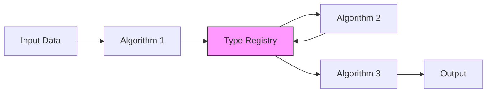

AutoGOAL's pipeline system enables automatic composition of algorithms based on semantic type compatibility. This page explains how pipelines are constructed, executed, and optimized.

## What is a Pipeline?

A **pipeline** in AutoGOAL is a sequence of algorithms where:
- Each algorithm has typed inputs and outputs
- Output of one algorithm feeds into inputs of subsequent algorithms
- The entire sequence transforms input data to desired output

```python
from autogoal.kb import Pipeline, AlgorithmBase
from autogoal.kb import MatrixContinuousDense, VectorCategorical

# Example: Text classification pipeline
# Input: List of documents → Output: Categories
pipeline = Pipeline(
    algorithms=[
        Tokenizer(),      # Seq[Document] → Seq[Seq[Word]]
        TfidfVectorizer(), # Seq[Seq[Word]] → MatrixContinuousDense
        LogisticRegression() # MatrixContinuousDense → VectorCategorical
    ],
    input_types=[Seq[Document], VectorCategorical]
)
```

## Pipeline Architecture

### Pipeline Class

The `Pipeline` class (defined in `autogoal/kb/_algorithm.py:302`) manages algorithm execution:

```python
class Pipeline:
    def __init__(self, algorithms: List[Algorithm], 
                 input_types: List[Type[SemanticType]]):
        self.algorithms = algorithms
        self.input_types = input_types
    
    def run(self, *inputs):
        # Execute algorithms sequentially
        data = {}
        
        # Store initial inputs
        for i, t in zip(inputs, self.input_types):
            data[t] = i
        
        # Execute each algorithm
        for algorithm in self.algorithms:
            args = build_input_args(algorithm, data)
            output = algorithm.run(**args)
            output_type = algorithm.output_type()
            data[output_type] = output
        
        return data[self.algorithms[-1].output_type()]
```

<Note>
The pipeline maintains a dictionary of available data types at each step, allowing algorithms to consume any compatible type generated earlier in the pipeline.
</Note>

### Algorithm Base Class

All algorithms must inherit from `AlgorithmBase` and implement a typed `run` method:

```python
from autogoal.kb import AlgorithmBase
from autogoal.kb import Seq, Sentence, MatrixContinuousDense
from autogoal.grammar import ContinuousValue, DiscreteValue

class TfidfVectorizer(AlgorithmBase):
    def __init__(self, 
                 max_features: DiscreteValue(100, 10000),
                 min_df: ContinuousValue(0.0, 0.1)):
        self.max_features = max_features
        self.min_df = min_df
        # Initialize internal model
    
    def run(self, 
            X: Seq[Sentence]) -> MatrixContinuousDense:
        # Transform text to matrix
        return matrix
```

Key points:
- `__init__` parameters are hyperparameters (annotated with grammar types)
- `run` parameters are data inputs (annotated with semantic types)
- Return type annotation specifies output semantic type

## Pipeline Graph Construction

### Building the Graph

AutoGOAL constructs a directed graph where:
- **Nodes** represent algorithm types
- **Edges** connect compatible algorithms
- **Paths** from start to end are valid pipelines

```python
from autogoal.kb import build_pipeline_graph
from autogoal.kb import MatrixContinuousDense, VectorCategorical, Seq, Document

# Define problem
input_types = [Seq[Document], VectorCategorical]  # Supervised learning
output_type = VectorCategorical

# Registry of available algorithms
from autogoal_contrib import find_classes
registry = find_classes()

# Build pipeline space
pipeline_space = build_pipeline_graph(
    input_types=input_types,
    output_type=output_type,
    registry=registry
)
```

### Graph Construction Algorithm

The construction algorithm (from `autogoal/kb/_algorithm.py:567`) works as follows:

<Steps>
  <Step title="Initialize with Input-Compatible Algorithms">
    Find all algorithms that can process the input types
    ```python
    for algorithm in pool:
        if algorithm.is_compatible_with(input_types):
            # Add as starting node
            open_nodes.append(PipelineNode(algorithm, ...))
    ```
  </Step>
  
  <Step title="Breadth-First Expansion">
    For each node, find algorithms that can consume its outputs
    ```python
    while open_nodes:
        node = open_nodes.pop(0)
        guaranteed_types = node.output_types
        
        for algorithm in pool:
            if algorithm.is_compatible_with(guaranteed_types):
                # Add edge to graph
                G.add_edge(node, new_node)
    ```
  </Step>
  
  <Step title="Filter Valid Paths">
    Remove nodes not connected to end (target output type)
    ```python
    reachable = nx.dfs_preorder_nodes(G.reverse(), End)
    unreachable = set(G.nodes) - reachable
    G.remove_nodes_from(unreachable)
    ```
  </Step>
</Steps>

### Compatibility Rules

Two key functions determine compatibility:

**Algorithm-to-Types Compatibility**

```python
# From autogoal/kb/_algorithm.py:150
def is_compatible_with(cls, input_types):
    """Check if algorithm can run with given input types"""
    my_inputs = cls.input_types()
    
    for needed in my_inputs:
        for having in input_types:
            if issubclass(having, needed):
                break
        else:
            return False  # Missing required input
    
    return True
```

**Input Argument Mapping**

```python
# From autogoal/kb/_algorithm.py:269
def build_input_args(algorithm, values):
    """Map available data to algorithm's run() parameters"""
    result = {}
    
    for name, type in zip(algorithm.input_args(), 
                          algorithm.input_types()):
        for available_type in values:
            if issubclass(available_type, type):
                result[name] = values[available_type]
                break
    
    return result
```

<Tip>
The graph construction automatically handles type hierarchies. If an algorithm expects `Text` and you have `Sentence`, it will be considered compatible since `Sentence` is a subclass of `Text`.
</Tip>

## Pipeline Sampling

Once the graph is built, pipelines are sampled by traversing paths:

```python
# Sample from pipeline space
pipeline = pipeline_space.sample(sampler=sampler)
```

The sampling process (from `autogoal/grammar/_graph.py:348`):

```python
def _sample(self, symbol, max_iterations, sampler):
    path = [GraphSpace.Start]  # Start at beginning
    visited = set()
    
    while max_iterations > 0:
        last_node = path[-1]
        
        if last_node == GraphSpace.End:
            break  # Reached valid pipeline
        
        # Get next possible algorithms
        next_nodes = list(self.graph.neighbors(last_node))
        
        # Let sampler choose
        next_node = sampler.choice(next_nodes)
        path.append(next_node)
    
    # Instantiate algorithms along path
    return [node.sample(sampler) for node in path[1:-1]]
```

### PipelineNode

Each node wraps an algorithm type with a grammar:

```python
class PipelineNode:
    def __init__(self, algorithm, input_types, output_types, registry):
        self.algorithm = algorithm
        self.input_types = set(input_types)
        self.output_types = set(output_types)
        # Generate grammar for hyperparameters
        self.grammar = generate_cfg(self.algorithm, registry)
    
    def sample(self, sampler):
        # Sample algorithm instance with hyperparameters
        return self.grammar.sample(sampler=sampler)
```

This means each edge traversal involves:
1. Choosing which algorithm type to use (structural decision)
2. Sampling hyperparameters for that algorithm (parametric decision)

## Sequence Algorithms

AutoGOAL automatically creates sequence versions of algorithms:

```python
# From autogoal/kb/_algorithm.py:402
def make_seq_algorithm(algorithm):
    """Lift algorithm to process sequences"""
    
    class SeqAlgorithm(Algorithm):
        def __init__(self, *args, **kwargs):
            self.inner = algorithm(*args, **kwargs)
        
        def run(self, *args, **kwargs):
            # Apply inner algorithm to each element
            args_kwargs = _make_list_args_and_kwargs(*args, **kwargs)
            return [self.inner.run(*t.args, **t.kwargs) 
                    for t in args_kwargs]
        
        @classmethod
        def input_types(cls):
            # Seq[T] for each input type T
            return tuple(Seq[t] for t in algorithm.input_types())
        
        @classmethod
        def output_type(cls):
            return Seq[algorithm.output_type()]
    
    return SeqAlgorithm
```

**Example Usage:**

```python
# Original algorithm: Sentence → Vector
class Embedder(AlgorithmBase):
    def run(self, x: Sentence) -> VectorContinuous:
        return embedding

# Automatically generated: Seq[Sentence] → Seq[Vector]
SeqEmbedder = make_seq_algorithm(Embedder)

# Works on lists
embedder = SeqEmbedder()
vectors = embedder.run(["hello world", "goodbye"])
```

<Note>
Sequence algorithms are automatically added to the pipeline graph with configurable depth (default: 3 levels of nesting).
</Note>

## Pipeline Execution

### Data Flow

During execution, the pipeline maintains a type-to-value mapping:



The registry allows algorithms to access any previously computed type:

```python
# Initial state
data = {
    Seq[Document]: documents,
    VectorCategorical: labels
}

# After Tokenizer: Seq[Document] → Seq[Seq[Word]]
data = {
    Seq[Document]: documents,
    VectorCategorical: labels,
    Seq[Seq[Word]]: tokens  # New type available
}

# After Vectorizer: Seq[Seq[Word]] → MatrixContinuousDense
data = {
    Seq[Document]: documents,
    VectorCategorical: labels,
    Seq[Seq[Word]]: tokens,
    MatrixContinuousDense: features  # New type available
}
```

### Training and Evaluation Modes

Pipelines support message passing for mode switching:

```python
# Switch to training mode
pipeline.send('train')
pipeline.run(X_train, y_train)

# Switch to evaluation mode
pipeline.send('eval')
predictions = pipeline.run(X_test, None)
```

Algorithms can implement these methods:

```python
class MyAlgorithm(AlgorithmBase):
    def train(self):
        self.mode = 'train'
    
    def eval(self):
        self.mode = 'eval'
    
    def run(self, X, y=None):
        if self.mode == 'train' and y is not None:
            # Fit model
            self.model.fit(X, y)
        return self.model.predict(X)
```

## Supervised Pipelines

For supervised learning, AutoGOAL uses the `Supervised` type wrapper:

```python
from autogoal.kb import Supervised

# Supervised version of a type
Supervised[MatrixContinuousDense]  # Data with labels

# Type relationships
issubclass(Supervised[Vector], Vector)  # True
issubclass(Vector, Supervised[Vector])  # False
```

This allows unsupervised algorithms to process supervised data:

```python
class PCA(AlgorithmBase):
    def run(self, X: MatrixContinuousDense) -> MatrixContinuousDense:
        return self.transform(X)

# Can be used in supervised pipeline because:
# Supervised[MatrixContinuousDense] is subclass of MatrixContinuousDense
```

## Pipeline Serialization

Pipelines can be saved and loaded:

```python
# Serialize
serialized = pipeline.serialize()

# Deserialize
pipeline = Pipeline.deserialize(serialized)

# Or save to folder structure
pipeline.save_algorithms(path)
algorithms, inputs = Pipeline.load_algorithms(path)
loaded_pipeline = Pipeline(algorithms, inputs)
```

## Advanced Features

### Multi-Input Pipelines

Pipelines can consume multiple input types:

```python
# Image + Text classification
input_types = [Tensor3, Seq[Sentence], VectorCategorical]
output_type = VectorCategorical

pipeline_space = build_pipeline_graph(
    input_types=input_types,
    output_type=output_type,
    registry=registry
)
```

Algorithms can use any combination:

```python
class MultiModalClassifier(AlgorithmBase):
    def run(self, 
            images: Tensor3,
            text: Seq[Sentence],
            labels: VectorCategorical) -> VectorCategorical:
        # Combine modalities
        return predictions
```

### Graph Pruning Strategies

The graph builder includes several pruning rules (from `autogoal/kb/_algorithm.py:634`):

<Accordion title="No Duplicate Algorithms">
```python
# Never apply same algorithm twice
if algorithm == node.algorithm:
    continue
```
</Accordion>

<Accordion title="Require Novel Output Types">
```python
# Skip if output type already exists (unless idempotent)
if (algorithm.output_type() in guaranteed_types and
    tuple([algorithm.output_type()]) != algorithm.input_types()):
    continue
```
</Accordion>

<Accordion title="Must Use Previous Output">
```python
# Next algorithm must consume last node's output
is_using_last_output = False
for input_type in algorithm.input_types():
    if issubclass(node_output_type, input_type):
        is_using_last_output = True
        break
if not is_using_last_output:
    continue
```
</Accordion>

## Best Practices

<CardGroup cols={2}>
  <Card title="Type Annotations" icon="tags">
    Always annotate `run()` parameters and return types with semantic types
  </Card>
  <Card title="Hyperparameter Bounds" icon="sliders">
    Use appropriate ranges in `DiscreteValue` and `ContinuousValue`
  </Card>
  <Card title="Stateless Execution" icon="arrows-rotate">
    Make `run()` idempotent for reliable pipeline execution
  </Card>
  <Card title="Mode Handling" icon="toggle-on">
    Implement `train()` and `eval()` for algorithms with internal state
  </Card>
</CardGroup>

## Common Patterns

### Feature Engineering Pipeline

```python
from autogoal.kb import AlgorithmBase, MatrixContinuousDense
from autogoal.grammar import DiscreteValue, CategoricalValue

class FeatureSelector(AlgorithmBase):
    def __init__(self, 
                 k: DiscreteValue(10, 100),
                 method: CategoricalValue('variance', 'mutual_info')):
        self.k = k
        self.method = method
    
    def run(self, X: MatrixContinuousDense) -> MatrixContinuousDense:
        # Select top k features
        return selected_features

class PolynomialFeatures(AlgorithmBase):
    def __init__(self, degree: DiscreteValue(2, 4)):
        self.degree = degree
    
    def run(self, X: MatrixContinuousDense) -> MatrixContinuousDense:
        # Generate polynomial features
        return poly_features
```

### Text Processing Pipeline

```python
from autogoal.kb import Seq, Document, Sentence, Word

class Tokenizer(AlgorithmBase):
    def run(self, X: Seq[Document]) -> Seq[Seq[Word]]:
        return [doc.split() for doc in X]

class Stemmer(AlgorithmBase):
    def run(self, X: Seq[Seq[Word]]) -> Seq[Seq[Word]]:
        return [[stem(word) for word in doc] for doc in X]
```

## Next Steps

<CardGroup cols={2}>
  <Card title="Search Spaces" icon="cube" href="/concepts/search-spaces">
    Learn how grammars define the space of possible pipelines
  </Card>
  <Card title="Semantic Types" icon="tags" href="/concepts/semantic-types">
    Understand the type system in depth
  </Card>
  <Card title="Optimization" icon="chart-line" href="/concepts/optimization">
    See how search algorithms find optimal pipelines
  </Card>
  <Card title="Algorithm Guide" icon="code" href="/guides/custom-algorithms">
    Create your own custom algorithms
  </Card>
</CardGroup>
