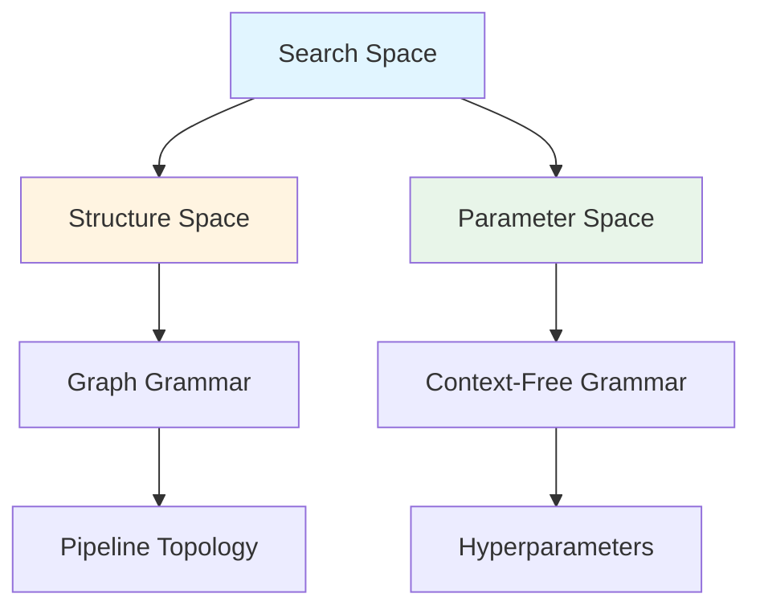
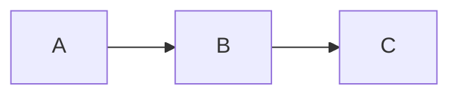
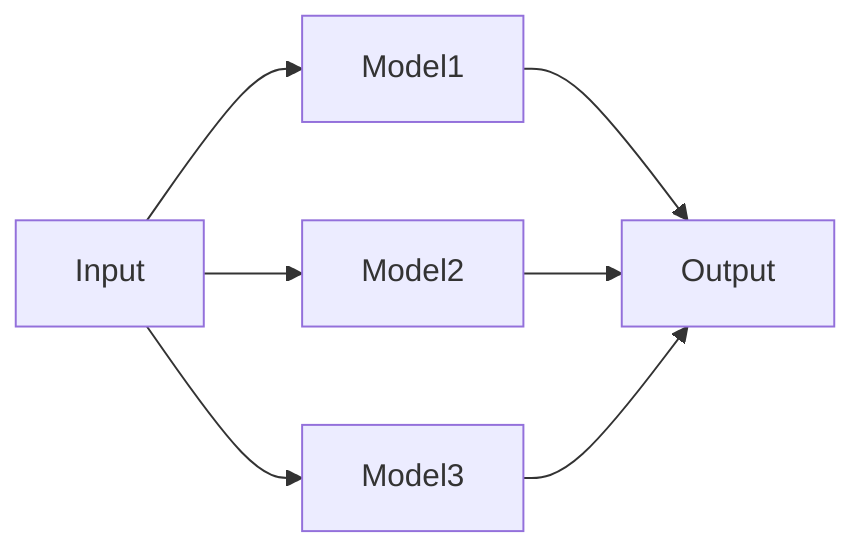

AutoGOAL uses **grammars** to define search spaces - the set of all possible solutions that can be generated and optimized. This page explains how to define search spaces using context-free grammars (CFG) and graph grammars.

## What is a Search Space?

A search space is the set of all possible configurations that an optimization algorithm can explore. In AutoGOAL:

- **Context-Free Grammars (CFG)** define spaces of algorithm instances with different hyperparameters
- **Graph Grammars** define spaces of algorithm structures (pipeline topologies)
- **Pipeline Spaces** combine both to define complete pipeline configurations



## Context-Free Grammars

CFGs define hierarchical search spaces for algorithm configurations.

### Grammar Basics

A CFG consists of:
- **Symbols**: Represent choices or values
- **Productions**: Rules for expanding symbols
- **Start symbol**: Entry point for generation

```python
from autogoal.grammar import (
    ContextFreeGrammar, 
    Symbol, 
    Callable, 
    Distribution
)

# Create grammar
grammar = ContextFreeGrammar(
    start=Symbol('Classifier')
)

# Add production: Classifier → LogisticRegression(C=<C>)
grammar.add(
    Symbol('Classifier'),
    Callable(
        head=Symbol('Classifier'),
        grammar=grammar,
        name='LogisticRegression',
        C=Symbol('C')
    )
)

# Add production: C → continuous(min=0.01, max=10)
grammar.add(
    Symbol('C'),
    Distribution(
        head=Symbol('C'),
        grammar=grammar,
        name='continuous',
        min=0.01,
        max=10
    )
)
```

### Automatic Grammar Generation

AutoGOAL can automatically generate grammars from class annotations:

```python
from autogoal.grammar import (
    generate_cfg,
    DiscreteValue,
    ContinuousValue,
    CategoricalValue,
    BooleanValue
)

class RandomForest:
    def __init__(self,
                 n_estimators: DiscreteValue(10, 500),
                 max_depth: DiscreteValue(3, 20),
                 min_samples_split: ContinuousValue(0.01, 0.5),
                 criterion: CategoricalValue('gini', 'entropy'),
                 bootstrap: BooleanValue()):
        self.n_estimators = n_estimators
        self.max_depth = max_depth
        self.min_samples_split = min_samples_split
        self.criterion = criterion
        self.bootstrap = bootstrap

# Generate grammar automatically
grammar = generate_cfg(RandomForest)
print(grammar)
```

Output:
```
<RandomForest>                      := RandomForest (n_estimators=<RandomForest_n_estimators>, max_depth=<RandomForest_max_depth>, min_samples_split=<RandomForest_min_samples_split>, criterion=<RandomForest_criterion>, bootstrap=<RandomForest_bootstrap>)
<RandomForest_n_estimators>         := discrete (min=10, max=500)
<RandomForest_max_depth>            := discrete (min=3, max=20)
<RandomForest_min_samples_split>    := continuous (min=0.01, max=0.5)
<RandomForest_criterion>            := categorical (options=['gini', 'entropy'])
<RandomForest_bootstrap>            := boolean
```

### Grammar Value Types

AutoGOAL provides several annotation types:

<Accordion title="DiscreteValue(min, max)">
Integer value in range `[min, max]`

```python
n_neighbors: DiscreteValue(1, 20)
```

Generates:
```python
value = sampler.discrete(min=1, max=20)  # e.g., 7
```
</Accordion>

<Accordion title="ContinuousValue(min, max)">
Floating-point value in range `[min, max]`

```python
learning_rate: ContinuousValue(0.001, 0.1)
```

Generates:
```python
value = sampler.continuous(min=0.001, max=0.1)  # e.g., 0.0234
```
</Accordion>

<Accordion title="CategoricalValue(*options)">
One choice from a set of options

```python
kernel: CategoricalValue('linear', 'rbf', 'poly')
```

Generates:
```python
value = sampler.categorical(options=['linear', 'rbf', 'poly'])  # e.g., 'rbf'
```
</Accordion>

<Accordion title="BooleanValue()">
True or False

```python
fit_intercept: BooleanValue()
```

Generates:
```python
value = sampler.boolean()  # True or False
```
</Accordion>

### Union Types

Define a choice between multiple classes:

```python
from autogoal.grammar import Union

class SVM:
    def __init__(self, C: ContinuousValue(0.1, 10)):
        self.C = C

class RandomForest:
    def __init__(self, n_estimators: DiscreteValue(10, 200)):
        self.n_estimators = n_estimators

class NeuralNetwork:
    def __init__(self, hidden_size: DiscreteValue(50, 500)):
        self.hidden_size = hidden_size

# Create union
Classifier = Union('Classifier', SVM, RandomForest, NeuralNetwork)

# Generate grammar
grammar = generate_cfg(Classifier)
```

This creates a grammar where `Classifier` can expand to any of the three options:

```
<Classifier> := <SVM> | <RandomForest> | <NeuralNetwork>
<SVM>        := SVM (C=<SVM_C>)
<SVM_C>      := continuous (min=0.1, max=10)
...
```

### Subset Types

Define a subset selection from multiple options:

```python
from autogoal.grammar import Subset

class FeatureEngineering:
    def __init__(self, 
                 transformers: Subset(
                     'Transformers',
                     'StandardScaler',
                     'MinMaxScaler', 
                     'PCA',
                     'PolynomialFeatures',
                     allow_empty=False
                 )):
        self.transformers = transformers
```

Sampling returns a list of selected items:
```python
# Might generate:
['StandardScaler', 'PCA']  # Selected 2 transformers
['MinMaxScaler', 'PolynomialFeatures', 'PCA']  # Selected 3
```

### Nested Grammars

Grammars can reference other classes:

```python
class Preprocessor:
    def __init__(self, scaler: CategoricalValue('standard', 'minmax')):
        self.scaler = scaler

class Model:
    def __init__(self, 
                 preprocessor: Preprocessor,  # Nested class
                 C: ContinuousValue(0.1, 10)):
        self.preprocessor = preprocessor
        self.C = C

grammar = generate_cfg(Model)
```

Generated grammar:
```
<Model>                := Model (preprocessor=<Preprocessor>, C=<Model_C>)
<Preprocessor>         := Preprocessor (scaler=<Preprocessor_scaler>)
<Preprocessor_scaler>  := categorical (options=['standard', 'minmax'])
<Model_C>              := continuous (min=0.1, max=10)
```

## Sampling from Grammars

### Basic Sampling

```python
from autogoal.sampling import Sampler

# Create sampler
sampler = Sampler(random_state=42)

# Sample from grammar
instance = grammar.sample(sampler=sampler)
print(instance)
# RandomForest(n_estimators=234, max_depth=12, ...)
```

### Sampler Types

<CardGroup cols={2}>
  <Card title="Sampler" icon="dice">
    Uniform random sampling
  </Card>
  <Card title="ModelSampler" icon="brain">
    Learns probability distributions from successful samples
  </Card>
  <Card title="ReplaySampler" icon="rotate">
    Records and replays sampling decisions
  </Card>
  <Card title="ExhaustiveSampler" icon="list">
    Systematically explores all combinations
  </Card>
</CardGroup>

### Sampling with Handles

Handles enable model-based sampling:

```python
from autogoal.sampling import ModelSampler

# Sample with tracking
sampler = ModelSampler()
value = sampler.discrete(min=10, max=500, handle='n_estimators')

# Updates recorded for learning
print(sampler.updates)
# {'n_estimators': [234]}
```

## Graph Grammars

Graph grammars define structural search spaces for pipeline topologies.

### Basic Graph Grammar

```python
from autogoal.grammar import GraphGrammar, Path, Block, Node, Epsilon

# Create graph grammar
grammar = GraphGrammar(start='Pipeline')

# Add production: Pipeline → Preprocessing → Model → Postprocessing
grammar.add(
    'Pipeline',
    Path('Preprocessing', 'Model', 'Postprocessing')
)

# Add production: Preprocessing → Scaler | Normalizer
grammar.add(
    'Preprocessing',
    Block('Scaler', 'Normalizer')  # Multiple parallel options
)

# Add production: Model → Classifier
grammar.add(
    'Model',
    Node('Classifier')
)

# Add production: Postprocessing → ε (empty)
grammar.add(
    'Postprocessing',
    Epsilon()  # Can be skipped
)
```

### Graph Patterns

<Accordion title="Node(cls)">
Single node in the graph

```python
from autogoal.grammar import Node

grammar.add('Classifier', Node(RandomForest))
```
</Accordion>

<Accordion title="Path(*items)">
Sequential chain of nodes

```python
from autogoal.grammar import Path

# A → B → C
grammar.add('Pipeline', Path('A', 'B', 'C'))
```


</Accordion>

<Accordion title="Block(*items)">
Parallel nodes (all connect to same inputs/outputs)

```python
from autogoal.grammar import Block

# All in parallel
grammar.add('Ensemble', Block('Model1', 'Model2', 'Model3'))
```


</Accordion>

<Accordion title="Epsilon()">
Empty production (skips node)

```python
from autogoal.grammar import Epsilon

grammar.add('Optional', Epsilon())
```
</Accordion>

### Graph Sampling

```python
from autogoal.grammar import Graph
from autogoal.sampling import Sampler

# Sample structure
sampler = Sampler(random_state=42)
graph = grammar.sample(sampler=sampler)

# Graph is a NetworkX DiGraph
print(list(graph.nodes))
print(list(graph.edges))
```

## Pipeline Spaces

Pipeline spaces combine graph structure with parameter grammars.

### PipelineSpace

Created automatically by `build_pipeline_graph`:

```python
from autogoal.kb import build_pipeline_graph, PipelineSpace

pipeline_space = build_pipeline_graph(
    input_types=[MatrixContinuousDense, VectorCategorical],
    output_type=VectorCategorical,
    registry=[SVM, RandomForest, LogisticRegression]
)

# PipelineSpace combines:
# 1. Graph of compatible algorithm sequences (structure)
# 2. CFG for each algorithm's hyperparameters (parameters)
```

### Sampling Pipelines

```python
from autogoal.sampling import Sampler

sampler = Sampler(random_state=42)
pipeline = pipeline_space.sample(sampler=sampler)

print(pipeline)
# Pipeline(
#   algorithms=[
#     StandardScaler(),
#     RandomForest(n_estimators=234, max_depth=12, ...)
#   ]
# )
```

Each sample involves:
1. **Structural decision**: Which path through the graph?
2. **Parametric decision**: What hyperparameters for each algorithm?

### PipelineNode

Each node in the pipeline graph contains:

```python
class PipelineNode:
    def __init__(self, algorithm, input_types, output_types, registry):
        self.algorithm = algorithm  # Algorithm class
        self.input_types = input_types  # Available inputs
        self.output_types = output_types  # Guaranteed outputs
        self.grammar = generate_cfg(algorithm, registry)  # Hyperparameter grammar
    
    def sample(self, sampler):
        # Sample algorithm with hyperparameters
        return self.grammar.sample(sampler=sampler)
```

## Advanced Grammar Features

### Conditional Productions

Create custom productions with complex logic:

```python
from autogoal.grammar import Production

class ConditionalProduction(Production):
    def sample(self, sampler, namespace, max_iterations):
        # Custom sampling logic
        if sampler.boolean():
            return namespace['OptionA']()
        else:
            return namespace['OptionB']()
```

### Grammar Introspection

Inspect generated grammars:

```python
grammar = generate_cfg(RandomForest)

# Print as string
print(str(grammar))

# Access productions
for symbol, production in grammar._productions.items():
    print(f"{symbol} → {production}")

# Access namespace
print(grammar.namespace.keys())
# ['RandomForest']
```

### Custom Generate Methods

Classes can define custom grammar generation:

```python
class CustomClass:
    @classmethod
    def generate_cfg(cls, grammar, head):
        # Custom grammar construction
        symbol = head or Symbol(cls.__name__)
        # ... add custom productions ...
        return grammar
```

## Grammar Composition

### Combining Grammars

```python
# Create separate grammars
preprocessor_grammar = generate_cfg(Preprocessor)
model_grammar = generate_cfg(Model)

# Combine into pipeline grammar
class Pipeline:
    def __init__(self,
                 preprocessor: Preprocessor,
                 model: Model):
        self.preprocessor = preprocessor
        self.model = model

pipeline_grammar = generate_cfg(Pipeline)
```

### Registry-Based Generation

Share class registry across grammars:

```python
registry = [SVM, RandomForest, LogisticRegression]

# All grammars share the registry
grammar1 = generate_cfg(Classifier1, registry=registry)
grammar2 = generate_cfg(Classifier2, registry=registry)
```

## Search Space Size

### Calculating Space Size

The search space size depends on:

<Steps>
  <Step title="Structural Choices">
    Number of valid paths through pipeline graph
  </Step>
  
  <Step title="Categorical Parameters">
    Product of option counts: `|opt1| × |opt2| × ...`
  </Step>
  
  <Step title="Continuous Parameters">
    Infinite (but discretized during sampling)
  </Step>
</Steps>

Example:
```python
# 3 algorithm choices
Classifier = Union('Classifier', SVM, RF, LR)

# SVM: kernel in {linear, rbf, poly} = 3 options
#      C continuous = ∞
# Space size ≈ 3 × ∞ (continuous parameters dominate)
```

### Effective Search Space

With discretization:

```python
# Discrete approximation
C: DiscreteValue(1, 100)  # 100 options
kernel: CategoricalValue('linear', 'rbf', 'poly')  # 3 options

# Effective size: 100 × 3 = 300 configurations
```

## Best Practices

<CardGroup cols={2}>
  <Card title="Reasonable Ranges" icon="arrows-left-right">
    Set parameter bounds based on domain knowledge
    ```python
    # Too wide
    n_estimators: DiscreteValue(1, 10000)
    
    # Better
    n_estimators: DiscreteValue(10, 500)
    ```
  </Card>
  
  <Card title="Log Scales" icon="chart-line">
    Use log-scale sampling for parameters spanning orders of magnitude
    ```python
    # Linear scale (poor for wide ranges)
    C: ContinuousValue(0.001, 1000)
    
    # Log scale (better)
    C: ContinuousValue(1e-3, 1e3)
    # Then: value = 10 ** sampled_value
    ```
  </Card>
  
  <Card title="Conditional Parameters" icon="code-branch">
    Some parameters only apply in certain contexts
    ```python
    def __init__(self, 
                 kernel: CategoricalValue('linear', 'rbf'),
                 gamma: ContinuousValue(0.001, 1)):
        self.kernel = kernel
        # gamma only used if kernel='rbf'
        if kernel == 'rbf':
            self.gamma = gamma
    ```
  </Card>
  
  <Card title="Shared Subgrammars" icon="share-nodes">
    Reuse grammar components across algorithms
    ```python
    OptimParams = Union(
        'Optimizer',
        SGD, Adam, RMSprop
    )
    
    class NeuralNet:
        def __init__(self, optimizer: OptimParams):
            ...
    ```
  </Card>
</CardGroup>

## Common Patterns

### Ensemble Grammar

```python
from autogoal.grammar import Subset

class VotingEnsemble:
    def __init__(self,
                 estimators: Subset(
                     'Estimators',
                     SVM,
                     RandomForest,
                     LogisticRegression,
                     allow_empty=False
                 ),
                 voting: CategoricalValue('hard', 'soft')):
        self.estimators = estimators
        self.voting = voting
```

### Preprocessing Pipeline Grammar

```python
class PreprocessingPipeline:
    def __init__(self,
                 scaler: Union('Scaler', StandardScaler, MinMaxScaler, RobustScaler),
                 feature_selection: Union('Selector', SelectKBest, PCA, None),
                 polynomial_features: BooleanValue()):
        self.scaler = scaler
        self.feature_selection = feature_selection
        self.polynomial_features = polynomial_features
```

## Debugging Grammars

### Visualizing Grammars

```python
# Print grammar
print(grammar)

# Inspect symbols
for symbol in grammar._productions:
    print(f"Symbol: {symbol}")
    print(f"Production: {grammar[symbol]}")
```

### Testing Sampling

```python
from autogoal.sampling import Sampler

# Generate multiple samples
sampler = Sampler(random_state=42)
for i in range(5):
    sample = grammar.sample(sampler=sampler)
    print(f"Sample {i}: {sample}")
```

### Validating Grammar

```python
try:
    # Try to generate
    grammar = generate_cfg(MyClass)
    print("Grammar valid!")
except Exception as e:
    print(f"Grammar error: {e}")
```

## Next Steps

<CardGroup cols={2}>
  <Card title="Pipelines" icon="diagram-project" href="/concepts/pipelines">
    See how grammars are used in pipeline construction
  </Card>
  <Card title="Optimization" icon="chart-line" href="/concepts/optimization">
    Learn how search algorithms navigate these spaces
  </Card>
  <Card title="Grammar API" icon="code" href="/api/grammar/cfg">
    Complete grammar API reference
  </Card>
  <Card title="Graph Grammar" icon="diagram-project" href="/api/grammar/graph">
    Learn about graph-based grammars
  </Card>
</CardGroup>
