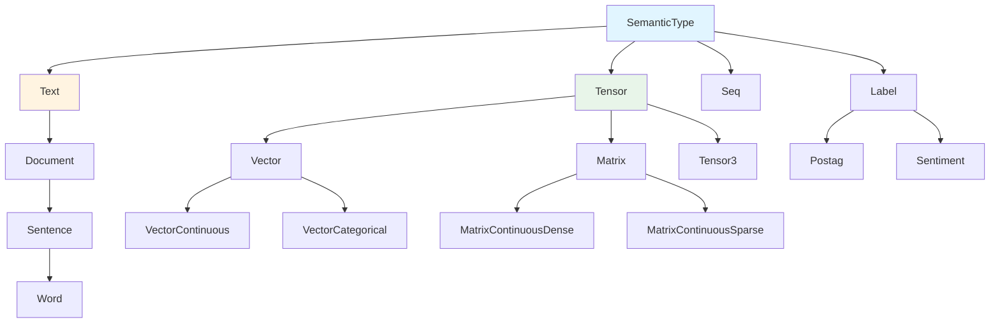

AutoGOAL uses a **semantic type system** to enable intelligent algorithm composition. Unlike structural types that describe data format (e.g., "array of floats"), semantic types describe data meaning (e.g., "sequence of sentences"). This enables AutoGOAL to automatically determine which algorithms can be composed together.

## Why Semantic Types?

Consider a list of strings `["hello world", "goodbye"]`. Structurally, this is `List[str]`. But semantically, it could be:

- A list of **documents** (for topic modeling)
- A list of **sentences** (for sentiment analysis)  
- A list of **words** (for embedding lookup)
- A list of **DNA sequences** (for bioinformatics)

Different semantic interpretations require different algorithms:

```python
# For documents: tokenize first
tokenizer(documents) → sentences

# For sentences: directly embed  
embedder(sentences) → vectors

# For words: lookup in vocabulary
vocab_lookup(words) → indices
```

Semantic types enable AutoGOAL to make these distinctions automatically.

## Type Hierarchy

AutoGOAL's semantic types form a hierarchy:



## Core Semantic Types

### Text Types

Hierarchy of natural language types:

```python
from autogoal.kb import Text, Document, Sentence, Word

# Type hierarchy
issubclass(Word, Sentence)      # True
issubclass(Sentence, Document)  # True
issubclass(Document, Text)      # True

# Instance checking
isinstance("hello world", Sentence)  # True (≤1 period)
isinstance("hello", Word)            # True (no spaces)
isinstance("Hello. World.", Document)  # True
```

**Matching Logic** (from `autogoal/kb/_semantics.py`):

```python
class Text(SemanticType):
    @classmethod
    def _match(cls, x):
        return isinstance(x, str)

class Sentence(Document):
    @classmethod
    def _match(cls, x):
        return super()._match(x) and x.count(".") <= 1

class Word(Sentence):
    @classmethod  
    def _match(cls, x):
        return super()._match(x) and " " not in x
```

<Tip>
The hierarchy allows algorithms expecting `Text` to accept `Word`, `Sentence`, or `Document`. But algorithms expecting `Word` will reject `Sentence` or `Document`.
</Tip>

### Tensor Types

Numeric array types with specialization:

```python
from autogoal.kb import (
    Tensor, Vector, Matrix,
    VectorContinuous, VectorCategorical,
    MatrixContinuousDense, MatrixContinuousSparse,
    Categorical, Continuous, Discrete,
    Dense, Sparse
)

import numpy as np

# Create data
v = np.array([1.0, 2.0, 3.0])
m = np.array([[1.0, 2.0], [3.0, 4.0]])

# Type checking
isinstance(v, Vector)                    # True
isinstance(v, VectorContinuous)          # True  
isinstance(m, Matrix)                    # True
isinstance(m, MatrixContinuousDense)     # True
```

**Specialization Syntax:**

```python
# Tensor[dimensions, data_type, structure]
Tensor[1, Continuous, Dense]   # 1D continuous dense = VectorContinuous
Tensor[2, Continuous, Dense]   # 2D continuous dense = MatrixContinuousDense
Tensor[2, Continuous, Sparse]  # 2D continuous sparse = MatrixContinuousSparse
Tensor[3, Continuous, Dense]   # 3D tensor (e.g., images)
Tensor[4, Continuous, Dense]   # 4D tensor (e.g., video)
```

**Type Parameters:**

<CardGroup cols={3}>
  <Card title="Dimension">
    Integer (1, 2, 3, 4, ...)
    
    Number of axes in array
  </Card>
  
  <Card title="Data Type">
    `Categorical`, `Continuous`, `Discrete`
    
    Kind of values stored
  </Card>
  
  <Card title="Structure">
    `Dense`, `Sparse`
    
    Storage format
  </Card>
</CardGroup>

**Subclass Relationships:**

```python
# More specialized → more general
issubclass(
    Tensor[2, Continuous, Dense],
    Tensor[2, None, None]
)  # True

issubclass(
    Tensor[2, Continuous, Dense], 
    Tensor[2, Continuous, None]
)  # True

issubclass(
    Tensor[2, Continuous, Dense],
    Tensor[2, None, Sparse]
)  # False (Dense ≠ Sparse)
```

### Sequence Types

Generic sequences of other types:

```python
from autogoal.kb import Seq, Word, Sentence, Document

# Sequence specialization
ListOfWords = Seq[Word]           # ["hello", "world"]
ListOfSentences = Seq[Sentence]   # ["Hello world.", "Goodbye."]
ListOfDocuments = Seq[Document]   # ["Doc 1...", "Doc 2..."]

# Sequence of sequences
ListOfListOfWords = Seq[Seq[Word]]  # [["hello", "world"], ["foo", "bar"]]

# Type checking
isinstance(["hello", "world"], Seq[Word])  # True
isinstance([["a", "b"], ["c"]], Seq[Seq[Word]])  # True

# Hierarchy
issubclass(Seq[Word], Seq[Sentence])  # True (Word < Sentence)
issubclass(Seq[Sentence], Seq[Word])  # False
```

**Implementation** (from `autogoal/kb/_semantics.py:210`):

```python
class Seq(SemanticType):
    __internal_types = {}  # Cache specialized types
    
    @classmethod
    def _specialize(cls, internal_type):
        # Return cached or create new specialized type
        if internal_type in cls.__internal_types:
            return cls.__internal_types[internal_type]
        
        class SeqImp(Seq):
            __internal_type__ = internal_type
            
            @classmethod
            def _match(cls, x):
                return (isinstance(x, (list, tuple)) and 
                        internal_type._match(x[0]))
            
            @classmethod
            def _conforms(cls, other):
                if not issubclass(other, Seq):
                    return False
                if other == Seq:
                    return True
                return issubclass(
                    cls.__internal_type__, 
                    other.__internal_type__
                )
        
        cls.__internal_types[internal_type] = SeqImp
        return SeqImp
```

### Label Types

For classification targets and annotations:

```python
from autogoal.kb import Label, Postag, Chunktag, Sentiment, Stem

# Generic label
y: Label

# Specialized labels
pos_tags: Seq[Postag]        # Part-of-speech tags
sentiments: Seq[Sentiment]   # Sentiment labels
stems: Seq[Stem]             # Word stems
```

## Type Operations

### Instance Checking

AutoGOAL overrides `isinstance` to use semantic matching:

```python
# Structural type checking
isinstance([1, 2, 3], list)  # True (Python built-in)

# Semantic type checking  
from autogoal.kb import Seq, Word
isinstance(["hello", "world"], Seq[Word])  # True (AutoGOAL)

# How it works (simplified)
class SemanticTypeMeta(type):
    def __instancecheck__(cls, instance):
        return cls._match(instance)
```

### Subclass Checking

AutoGOAL also customizes `issubclass`:

```python
from autogoal.kb import Word, Sentence, Text

# Hierarchy check
issubclass(Word, Sentence)  # True
issubclass(Sentence, Text)  # True
issubclass(Word, Text)      # True (transitive)

# With Tensor specialization
from autogoal.kb import Tensor, Continuous, Dense

issubclass(
    Tensor[2, Continuous, Dense],
    Tensor[2, None, None]
)  # True (more specific → more general)

issubclass(
    Tensor[2, None, None],
    Tensor[2, Continuous, Dense]
)  # False (cannot go more general → more specific)
```

### Type Inference

Automatically determine semantic type:

```python
from autogoal.kb import SemanticType
import numpy as np

# Infer text types
SemanticType.infer("hello")          # Word
SemanticType.infer("hello world")    # Sentence  
SemanticType.infer("Hello. World.")  # Document

# Infer tensor types
SemanticType.infer(np.array([1.0, 2.0]))         # VectorContinuous
SemanticType.infer(np.array([[1.0], [2.0]]))    # MatrixContinuousDense
SemanticType.infer(np.ones((2, 3, 4)))           # Tensor3
```

## Using Types in Algorithms

### Algorithm Annotations

Annotate `run()` method with semantic types:

```python
from autogoal.kb import AlgorithmBase
from autogoal.kb import Seq, Sentence, MatrixContinuousDense

class TfidfVectorizer(AlgorithmBase):
    def run(self, 
            X: Seq[Sentence]) -> MatrixContinuousDense:
        # Transform sentences to matrix
        return matrix

# AutoGOAL introspects types
TfidfVectorizer.input_types()   # (Seq[Sentence],)
TfidfVectorizer.output_type()   # MatrixContinuousDense
```

### Type Compatibility

Algorithms are compatible when output types match input types:

```python
class Tokenizer(AlgorithmBase):
    def run(self, X: Seq[Document]) -> Seq[Seq[Word]]:
        return tokenized

class Embedder(AlgorithmBase):
    def run(self, X: Seq[Word]) -> MatrixContinuousDense:
        return embeddings

# Can we compose?
Tokenizer.output_type()   # Seq[Seq[Word]]
Embedder.input_types()    # (Seq[Word],)

# Not directly! Need to flatten:
class Flattener(AlgorithmBase):
    def run(self, X: Seq[Seq[Word]]) -> Seq[Word]:
        return [word for sent in X for word in sent]

# Now: Tokenizer → Flattener → Embedder works
```

### Multi-Input Algorithms

Algorithms can have multiple inputs:

```python
from autogoal.kb import VectorCategorical

class Classifier(AlgorithmBase):
    def run(self,
            X: MatrixContinuousDense,
            y: VectorCategorical) -> VectorCategorical:
        # Train on X, y
        return predictions

# During pipeline execution, AutoGOAL provides correct arguments
pipeline.run(X_data, y_labels)
# → Classifier.run(X=X_data, y=y_labels)
```

## Supervised Types

Special wrapper for supervised learning:

```python
from autogoal.kb import Supervised

# Supervised wraps a type to indicate labels are present
Supervised[MatrixContinuousDense]  # Features with labels
Supervised[Seq[Document]]           # Documents with labels

# Subclass relationship
issubclass(
    Supervised[MatrixContinuousDense],
    MatrixContinuousDense
)  # True (supervised data IS feature data)

issubclass(
    MatrixContinuousDense,
    Supervised[MatrixContinuousDense]
)  # False (unsupervised ≠ supervised)
```

**Usage:**

```python
class UnsupervisedAlgorithm(AlgorithmBase):
    def run(self, X: MatrixContinuousDense) -> MatrixContinuousDense:
        # PCA, clustering, etc.
        return transformed

class SupervisedAlgorithm(AlgorithmBase):
    def run(self, 
            X: Supervised[MatrixContinuousDense],
            y: VectorCategorical) -> VectorCategorical:
        # Classification
        return predictions

# Supervised data can use unsupervised algorithms
# because Supervised[X] is subclass of X
```

## Advanced Type Features

### Custom Semantic Types

Define your own semantic types:

```python
from autogoal.kb import SemanticType

class ImagePath(SemanticType):
    @classmethod
    def _match(cls, x):
        # Match if string ends with image extension
        return (isinstance(x, str) and 
                any(x.endswith(ext) for ext in ['.jpg', '.png', '.gif']))

class AudioPath(SemanticType):
    @classmethod
    def _match(cls, x):
        return (isinstance(x, str) and
                any(x.endswith(ext) for ext in ['.wav', '.mp3']))

# Use in algorithms
class ImageLoader(AlgorithmBase):
    def run(self, path: ImagePath) -> Tensor3:
        # Load image from path
        return image_array
```

### Specialized Tensor Types

Create custom tensor specializations:

```python
from autogoal.kb import Tensor, Continuous, Dense

# Image types
GrayscaleImage = Tensor[2, Continuous, Dense]    # 2D grayscale
RGBImage = Tensor[3, Continuous, Dense]          # 3D RGB
ImageBatch = Tensor[4, Continuous, Dense]        # 4D batch

# Time series
TimeSeries = Tensor[2, Continuous, Dense]        # (time, features)
```

### Type Aliases

Create readable aliases:

```python
# From autogoal/kb/_semantics.py:502
Vector = Tensor[1, None, None]
VectorContinuous = Tensor[1, Continuous, None]
VectorCategorical = Tensor[1, Categorical, Dense]

Matrix = Tensor[2, None, None]
MatrixContinuousDense = Tensor[2, Continuous, Dense]
MatrixContinuousSparse = Tensor[2, Continuous, Sparse]

Tensor3 = Tensor[3, Continuous, Dense]
Tensor4 = Tensor[4, Continuous, Dense]
```

## Type Serialization

Semantic types are serializable:

```python
import pickle
from autogoal.kb import Seq, Word, Tensor, Continuous, Dense

# Serialize
data = pickle.dumps(Seq[Word])

# Deserialize  
loaded_type = pickle.loads(data)
assert loaded_type == Seq[Word]

# Works with complex types
complex_type = Tensor[2, Continuous, Dense]
data = pickle.dumps(complex_type)
loaded = pickle.loads(data)
assert loaded == complex_type
```

## Best Practices

<CardGroup cols={2}>
  <Card title="Choose Specific Types" icon="crosshairs">
    Use most specific type that accurately describes your data
    ```python
    # Too general
    def run(self, X: Tensor) -> Tensor
    
    # Better
    def run(self, X: MatrixContinuousDense) -> VectorCategorical
    ```
  </Card>
  
  <Card title="Document Semantics" icon="book">
    Clearly document what your types mean
    ```python
    class MyAlgorithm(AlgorithmBase):
        """Processes customer reviews.
        
        Input: Seq[Document] - customer review texts
        Output: VectorCategorical - sentiment labels (0=negative, 1=positive)
        """
        def run(self, X: Seq[Document]) -> VectorCategorical:
            ...
    ```
  </Card>
  
  <Card title="Leverage Hierarchy" icon="sitemap">
    Accept general types when possible
    ```python
    # Accepts Word, Sentence, or Document
    def run(self, X: Seq[Text]) -> Seq[Text]:
        return [x.lower() for x in X]
    ```
  </Card>
  
  <Card title="Type Validation" icon="check">
    Validate inputs match expected semantics
    ```python
    def run(self, X: Seq[Sentence]) -> ...
        assert all(isinstance(x, str) for x in X)
        assert all(x.count('.') <= 1 for x in X)
        ...
    ```
  </Card>
</CardGroup>

## Common Patterns

### Text Processing Chain

```python
Seq[Document]           # Raw documents
  ↓ Tokenizer
Seq[Seq[Word]]         # Tokenized documents
  ↓ Stemmer
Seq[Seq[Word]]         # Stemmed tokens
  ↓ TfidfVectorizer  
MatrixContinuousSparse # TF-IDF features
  ↓ Classifier
VectorCategorical      # Predictions
```

### Image Processing Chain

```python
Seq[ImagePath]         # Image file paths
  ↓ ImageLoader
Tensor4                # Image batch (N, H, W, C)
  ↓ Preprocessor
Tensor4                # Normalized images
  ↓ CNN
MatrixContinuousDense  # Feature vectors
  ↓ Classifier
VectorCategorical      # Class predictions
```

### Multi-Modal Fusion

```python
# Text branch
Seq[Document] → ... → MatrixContinuousDense (text_features)

# Image branch  
Seq[ImagePath] → ... → MatrixContinuousDense (image_features)

# Fusion
class MultiModalFusion(AlgorithmBase):
    def run(self,
            text_features: MatrixContinuousDense,
            image_features: MatrixContinuousDense) -> MatrixContinuousDense:
        return np.concatenate([text_features, image_features], axis=1)
```

## Debugging Types

### Type Mismatches

Common error when types don't align:

```python
class Algorithm1(AlgorithmBase):
    def run(self, X: Seq[Document]) -> MatrixContinuousDense:
        ...

class Algorithm2(AlgorithmBase):
    def run(self, X: Seq[Sentence]) -> VectorCategorical:
        ...

# Pipeline construction fails:
# Cannot connect Algorithm1 → Algorithm2
# Output: MatrixContinuousDense
# Expected: Seq[Sentence]
# These are incompatible types!
```

**Solution:** Add intermediate transformer

```python
class MatrixToSentences(AlgorithmBase):
    def run(self, X: MatrixContinuousDense) -> Seq[Sentence]:
        # Convert matrix back to sentences (e.g., decode)
        return sentences
```

### Inspecting Type Hierarchy

```python
from autogoal.kb import Word, Sentence, Document, Text

def print_hierarchy(type_class, indent=0):
    print(" " * indent + str(type_class))
    for subclass in type_class.__subclasses__():
        print_hierarchy(subclass, indent + 2)

print_hierarchy(Text)
# Text
#   Document
#     Sentence
#       Word
```

## Next Steps

<CardGroup cols={2}>
  <Card title="Pipelines" icon="diagram-project" href="/concepts/pipelines">
    See how semantic types enable pipeline composition
  </Card>
  <Card title="Custom Algorithms" icon="code" href="/guides/custom-algorithms">
    Create algorithms with custom semantic types
  </Card>
  <Card title="Type System API" icon="brackets-curly" href="/api/kb/overview">
    Explore the complete type system API
  </Card>
  <Card title="Data Types" icon="database" href="/api/kb/data-types">
    Reference of all built-in data types
  </Card>
</CardGroup>
