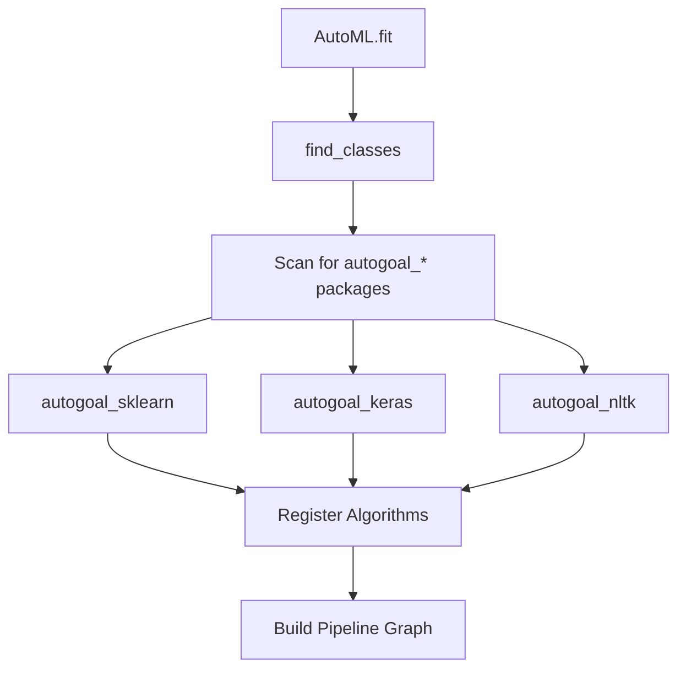

## Overview

AutoGOAL's contrib system allows you to package and distribute custom algorithms as installable Python packages. This modular architecture enables:

- Easy installation of algorithm collections
- Automatic discovery and registration
- Dependency isolation
- Version management
- Community contributions

## How Contrib Works

The contrib system automatically discovers and registers algorithms from installed packages with the `autogoal_` prefix.

### Architecture



### Package Discovery

AutoGOAL finds contrib packages automatically:

```python
from autogoal_contrib import find_classes

# Discovers all algorithms from installed contrib packages
algorithms = find_classes(
    include='.*',           # Regex to include algorithms
    exclude='Experimental'  # Regex to exclude algorithms
)

print(f"Found {len(algorithms)} algorithms")
for algo in algorithms:
    print(f"  - {algo.__name__} from {algo.__module__}")
```

## Creating a Contrib Package

<Steps>

### Step 1: Package Structure

Create a package with the `autogoal_` prefix:

```
autogoal_mylib/
├── autogoal_mylib/
│   ├── __init__.py
│   ├── classifiers.py
│   ├── transformers.py
│   └── requirements.txt
├── setup.py
├── README.md
└── LICENSE
```

### Step 2: Implement Algorithms

Create algorithm classes following AutoGOAL conventions:

```python
# autogoal_mylib/classifiers.py

from autogoal.kb import AlgorithmBase
from autogoal.kb import MatrixContinuousDense, VectorCategorical
from autogoal.utils import nice_repr

@nice_repr
class MyLibClassifier(AlgorithmBase):
    """Custom classifier from MyLib."""
    
    def __init__(
        self,
        learning_rate: float = 0.01,
        max_iterations: int = 100,
        regularization: float = 0.1
    ):
        self.learning_rate = learning_rate
        self.max_iterations = max_iterations
        self.regularization = regularization
        self._model = None
    
    def run(
        self,
        X: MatrixContinuousDense,
        y: VectorCategorical
    ) -> VectorCategorical:
        """Train and predict."""
        try:
            import mylib
        except ImportError:
            raise ImportError(
                "MyLib is required. Install with: pip install mylib"
            )
        
        if self._model is None:
            self._model = mylib.Classifier(
                lr=self.learning_rate,
                max_iter=self.max_iterations,
                reg=self.regularization
            )
            self._model.fit(X, y)
        
        return self._model.predict(X)
```

### Step 3: Create __init__.py

Expose your algorithms in the package's `__init__.py`:

```python
# autogoal_mylib/__init__.py

"""AutoGOAL contrib package for MyLib.

Provides classifiers and transformers from the MyLib library.
"""

__version__ = '0.1.0'

# Import all algorithm classes
from autogoal_mylib.classifiers import (
    MyLibClassifier,
    MyLibEnsembleClassifier
)

from autogoal_mylib.transformers import (
    MyLibScaler,
    MyLibFeatureSelector
)

# Optional: Define what should be discovered
__all__ = [
    'MyLibClassifier',
    'MyLibEnsembleClassifier',
    'MyLibScaler',
    'MyLibFeatureSelector'
]
```

### Step 4: Add Dependencies

Specify dependencies in `requirements.txt`:

```txt
mylib>=1.0.0
numpy>=1.19.0
scikit-learn>=0.24.0
```

### Step 5: Create setup.py

```python
# setup.py

from setuptools import setup, find_packages

with open('README.md', 'r') as f:
    long_description = f.read()

with open('autogoal_mylib/requirements.txt', 'r') as f:
    requirements = [line.strip() for line in f]

setup(
    name='autogoal-mylib',
    version='0.1.0',
    description='AutoGOAL contrib package for MyLib',
    long_description=long_description,
    long_description_content_type='text/markdown',
    author='Your Name',
    author_email='your.email@example.com',
    url='https://github.com/yourusername/autogoal-mylib',
    packages=find_packages(),
    install_requires=['autogoal>=0.7.0'] + requirements,
    classifiers=[
        'Development Status :: 3 - Alpha',
        'Intended Audience :: Science/Research',
        'License :: OSI Approved :: MIT License',
        'Programming Language :: Python :: 3.8',
        'Programming Language :: Python :: 3.9',
        'Programming Language :: Python :: 3.10',
    ],
    python_requires='>=3.8',
    package_data={
        'autogoal_mylib': ['requirements.txt']
    }
)
```

</Steps>

## Using Contrib Packages

### Installation

```bash
# Install from PyPI
pip install autogoal-mylib

# Install from source
git clone https://github.com/yourusername/autogoal-mylib
cd autogoal-mylib
pip install -e .
```

### Automatic Discovery

Once installed, algorithms are automatically available:

```python
from autogoal.ml import AutoML

# Algorithms from autogoal_mylib are automatically included
automl = AutoML(
    input=MatrixContinuousDense,
    output=VectorCategorical
)

automl.fit(X_train, y_train)
```

### Selective Loading

Filter which algorithms to use:

```python
from autogoal.ml import AutoML

# Only use algorithms from mylib
automl = AutoML(
    include_filter='autogoal_mylib.*'
)

# Exclude specific algorithms
automl = AutoML(
    exclude_filter='.*Experimental.*'
)

# Combine filters
automl = AutoML(
    include_filter='(sklearn|mylib).*',
    exclude_filter='.*Deprecated.*'
)
```

## Advanced Features

### CLI Extensions

Add custom commands to AutoGOAL's CLI:

```python
# autogoal_mylib/cli.py

import typer

typer_app = typer.Typer(name='mylib')

@typer_app.command('benchmark')
def benchmark(dataset: str):
    """Run MyLib benchmarks."""
    typer.echo(f"Benchmarking on {dataset}...")
    # Implementation

# In __init__.py
from autogoal_mylib.cli import typer_app
```

Now available as:
```bash
autogoal mylib benchmark --dataset iris
```

### Contrib Metadata

Provide metadata for better discovery:

```python
# autogoal_mylib/__init__.py

CONTRIB_METADATA = {
    'name': 'MyLib',
    'description': 'High-performance ML algorithms',
    'version': '0.1.0',
    'author': 'Your Name',
    'algorithms': [
        {
            'name': 'MyLibClassifier',
            'type': 'classifier',
            'input': ['continuous'],
            'output': ['categorical']
        }
    ],
    'dependencies': ['mylib>=1.0.0'],
    'license': 'MIT'
}
```

### Dependency Resolution

Handle missing dependencies gracefully:

```python
from autogoal.utils import get_contrib

class MyLibClassifier(AlgorithmBase):
    def __init__(self, **kwargs):
        # Check if mylib is installed
        try:
            import mylib
            self._available = True
        except ImportError:
            self._available = False
            import warnings
            warnings.warn(
                "MyLib not installed. This algorithm will not be used. "
                "Install with: pip install mylib"
            )
        
        super().__init__(**kwargs)
    
    def run(self, X, y):
        if not self._available:
            raise RuntimeError("MyLib is not installed")
        # Implementation
```

### Custom Semantic Types

Define domain-specific types:

```python
# autogoal_mylib/types.py

from autogoal.kb import SemanticType

class GraphData(SemanticType):
    """Represents graph-structured data."""
    pass

class MolecularStructure(GraphData):
    """Represents molecular structures."""
    pass

# Use in algorithms
class GraphClassifier(AlgorithmBase):
    def run(self, graph: GraphData, y: VectorCategorical) -> VectorCategorical:
        # Process graph data
        pass
```

## Contrib Package Utilities

AutoGOAL provides utilities for contrib packages:

### Finding Contrib Information

```python
from autogoal.utils import get_contrib, generate_installer
from pathlib import Path

# Get contrib name from algorithm class
contrib_name = get_contrib(MyLibClassifier)
print(f"Contrib: {contrib_name}")  # 'mylib'

# Generate installer script
contribs = ['sklearn', 'keras', 'mylib']
generate_installer(Path('./install'), contribs)
# Creates: ./install/contribs.sh
```

### Requirements Generation

```python
from autogoal.utils import generate_requirements

# Generate requirements.txt from used algorithms
algorithms = [MyLibClassifier, AnotherAlgorithm]
generate_requirements(algorithms)
# Creates requirements.txt with all dependencies
```

## Example: Complete Contrib Package

Here's a complete example wrapping a fictitious library:

<CodeGroup>

```python __init__.py
# autogoal_mylib/__init__.py

"""AutoGOAL contrib for MyLib - Advanced ML algorithms."""

__version__ = '0.1.0'

from autogoal_mylib.classifiers import (
    MyLibRandomForest,
    MyLibGradientBoosting
)

from autogoal_mylib.transformers import (
    MyLibPCA,
    MyLibLDA
)

CONTRIB_METADATA = {
    'name': 'MyLib',
    'version': __version__,
    'description': 'High-performance ML algorithms',
    'algorithms': 4,
    'types': ['classifier', 'transformer']
}

__all__ = [
    'MyLibRandomForest',
    'MyLibGradientBoosting',
    'MyLibPCA',
    'MyLibLDA'
]
```

```python classifiers.py
# autogoal_mylib/classifiers.py

from autogoal.kb import AlgorithmBase
from autogoal.kb import MatrixContinuousDense, VectorCategorical
from autogoal.utils import nice_repr
import numpy as np

@nice_repr
class MyLibRandomForest(AlgorithmBase):
    def __init__(
        self,
        n_trees: int = 100,
        max_depth: int = 10,
        min_samples_split: int = 2
    ):
        self.n_trees = n_trees
        self.max_depth = max_depth
        self.min_samples_split = min_samples_split
        self._model = None
        self._check_import()
    
    def _check_import(self):
        try:
            import mylib
            self._mylib = mylib
        except ImportError:
            raise ImportError(
                "MyLib is required for this algorithm. "
                "Install with: pip install mylib>=1.0.0"
            )
    
    def run(
        self,
        X: MatrixContinuousDense,
        y: VectorCategorical
    ) -> VectorCategorical:
        if self._model is None:
            self._model = self._mylib.RandomForest(
                n_estimators=self.n_trees,
                max_depth=self.max_depth,
                min_samples_split=self.min_samples_split
            )
            self._model.fit(X, y)
        
        return self._model.predict(X)
```

```python transformers.py
# autogoal_mylib/transformers.py

from autogoal.kb import AlgorithmBase
from autogoal.kb import MatrixContinuousDense
from autogoal.utils import nice_repr

@nice_repr
class MyLibPCA(AlgorithmBase):
    def __init__(self, n_components: int = 10):
        self.n_components = n_components
        self._transformer = None
    
    def run(self, X: MatrixContinuousDense) -> MatrixContinuousDense:
        try:
            import mylib
        except ImportError:
            raise ImportError("MyLib required: pip install mylib>=1.0.0")
        
        if self._transformer is None:
            self._transformer = mylib.PCA(n_components=self.n_components)
            self._transformer.fit(X)
        
        return self._transformer.transform(X)
```

```txt requirements.txt
# autogoal_mylib/requirements.txt
mylib>=1.0.0
numpy>=1.19.0
scikit-learn>=0.24.0
```

</CodeGroup>

## Testing Your Contrib Package

### Unit Tests

```python
# tests/test_classifiers.py

import pytest
import numpy as np
from autogoal_mylib import MyLibRandomForest
from autogoal.kb import MatrixContinuousDense, VectorCategorical

def test_mylib_random_forest():
    """Test MyLibRandomForest basic functionality."""
    X = np.random.rand(100, 10)
    y = np.random.randint(0, 2, 100)
    
    clf = MyLibRandomForest(n_trees=10, max_depth=5)
    
    # Test type compatibility
    assert MatrixContinuousDense in clf.input_types()
    assert clf.output_type() == VectorCategorical
    
    # Test execution
    y_pred = clf.run(X, y)
    assert len(y_pred) == len(y)

def test_hyperparameter_ranges():
    """Test that hyperparameters are within valid ranges."""
    clf = MyLibRandomForest(n_trees=50)
    assert clf.n_trees == 50
    assert clf.n_trees > 0
```

### Integration Tests

```python
# tests/test_integration.py

from autogoal.ml import AutoML
from autogoal_mylib import MyLibRandomForest
import numpy as np

def test_automl_integration():
    """Test that algorithms work with AutoML."""
    X = np.random.rand(100, 10)
    y = np.random.randint(0, 2, 100)
    
    automl = AutoML(
        include_filter='autogoal_mylib.*',
        search_iterations=10
    )
    
    automl.fit(X, y)
    
    # Check that our algorithms were used
    assert len(automl.best_pipelines_) > 0
    
    # Test prediction
    y_pred = automl.predict(X)
    assert len(y_pred) == len(y)
```

## Publishing Your Contrib Package

### To PyPI

```bash
# Build distribution
python setup.py sdist bdist_wheel

# Upload to TestPyPI first
pip install twine
twine upload --repository testpypi dist/*

# Test installation
pip install --index-url https://test.pypi.org/simple/ autogoal-mylib

# Upload to PyPI
twine upload dist/*
```

### Documentation

Create comprehensive documentation:

```markdown
# AutoGOAL MyLib

AutoGOAL contrib package for MyLib algorithms.

## Installation

```bash
pip install autogoal-mylib
```

## Algorithms

- **MyLibRandomForest**: Random forest classifier
- **MyLibGradientBoosting**: Gradient boosting classifier  
- **MyLibPCA**: Principal component analysis
- **MyLibLDA**: Linear discriminant analysis

## Usage

```python
from autogoal.ml import AutoML

automl = AutoML()
automl.fit(X_train, y_train)
```

Algorithms from autogoal-mylib are automatically discovered.
```

## Best Practices

<CardGroup cols={2}>

<Card title="Naming Convention" icon="tag">
Use `autogoal_<library>` format for package names
</Card>

<Card title="Type Annotations" icon="code">
Always use proper semantic types in `run` methods
</Card>

<Card title="Dependency Handling" icon="box">
Gracefully handle missing dependencies with helpful error messages
</Card>

<Card title="Documentation" icon="book">
Document all hyperparameters and their valid ranges
</Card>

</CardGroup>

## Example Contrib Packages

Learn from existing contrib packages:

- **autogoal-sklearn**: Scikit-learn algorithms
- **autogoal-keras**: Keras/TensorFlow deep learning
- **autogoal-nltk**: Natural language processing
- **autogoal-transformers**: Hugging Face transformers

## Next Steps

<CardGroup cols={2}>

<Card title="Custom Algorithms" href="/guides/custom-algorithms" icon="code">
Learn to create algorithm classes
</Card>

<Card title="Remote Execution" href="/guides/remote-execution" icon="server">
Scale your algorithms across machines
</Card>

</CardGroup>
