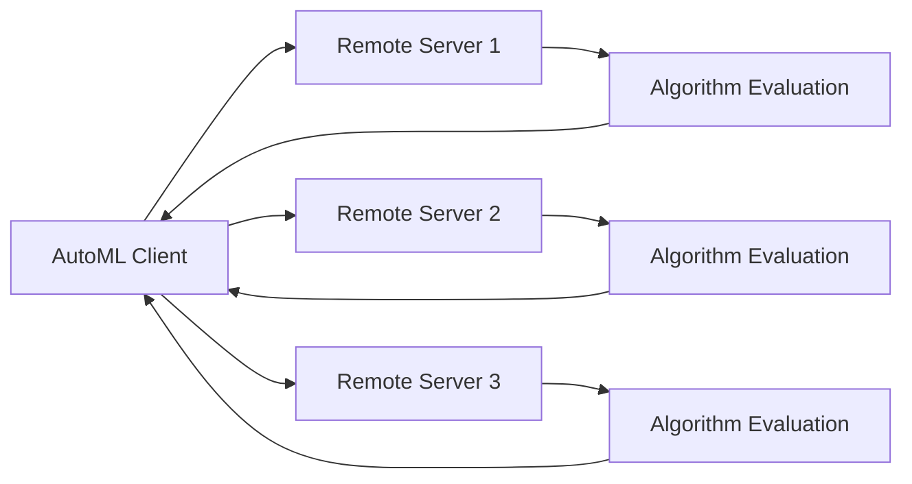

## Overview

AutoGOAL supports remote execution, allowing you to distribute algorithm search and evaluation across multiple machines. This is essential for:

- Large-scale hyperparameter optimization
- Evaluating expensive models (deep learning, etc.)
- Cloud-based AutoML pipelines
- Utilizing heterogeneous compute resources

<Note>
Remote execution requires proper network configuration and access to remote machines running AutoGOAL services.
</Note>

## Architecture

AutoGOAL's remote execution follows a client-server model:



- **Client**: Your local machine running `AutoML.fit()`
- **Servers**: Remote machines hosting algorithm classes
- **Communication**: HTTP/REST API for algorithm discovery and execution

## Setting Up Remote Servers

<Steps>

### Step 1: Install AutoGOAL on Server

On each remote machine:

```bash
# Install AutoGOAL and contrib packages
pip install autogoal autogoal-contrib

# Install specific algorithm libraries
pip install autogoal-sklearn autogoal-keras
```

### Step 2: Start Remote Service

Launch the AutoGOAL remote service:

```bash
# Start on default port (8000)
autogoal remote serve

# Start on custom port
autogoal remote serve --port 8080

# Specify host
autogoal remote serve --host 0.0.0.0 --port 8000

# Enable CORS for cross-origin requests
autogoal remote serve --cors
```

<Tip>
Use `--host 0.0.0.0` to allow connections from any network interface. For security, use a firewall to restrict access.
</Tip>

### Step 3: Verify Server is Running

Test the server:

```bash
# Check server health
curl http://your-server:8000/health

# List available algorithms
curl http://your-server:8000/algorithms
```

</Steps>

## Using Remote Algorithms

### Basic Usage

Connect to remote servers from your local AutoML instance:

```python
from autogoal.ml import AutoML

automl = AutoML(
    remote_sources=[
        'http://server1.example.com:8000',
        'http://server2.example.com:8000',
        'http://server3.example.com:8000'
    ],
    search_iterations=100
)

automl.fit(X_train, y_train)
```

AutoGOAL will:
1. Discover algorithms from all remote servers
2. Include them in the pipeline search space
3. Execute evaluations on the remote machines
4. Aggregate results locally

### Mixed Local and Remote

Combine local and remote algorithms:

```python
from autogoal.ml import AutoML

automl = AutoML(
    remote_sources=[
        'http://gpu-server.example.com:8000',  # Remote GPU server
    ],
    include_filter='(sklearn|remote).*',  # Use local sklearn + remote algorithms
    search_iterations=500
)

automl.fit(X_train, y_train)
```

### Server with Authentication

Connect to servers requiring authentication:

```python
from autogoal.ml import AutoML

# Server URL with authentication
remote_sources = [
    ('http://secure-server.example.com:8000', 'api-key-12345'),
    'http://public-server.example.com:8000',  # No auth
]

automl = AutoML(
    remote_sources=remote_sources,
    search_iterations=100
)

automl.fit(X_train, y_train)
```

## Advanced Configuration

### Resource Constraints

Specify resource limits for remote execution:

```python
from autogoal.ml import AutoML
from autogoal.utils import Gb, Min

automl = AutoML(
    remote_sources=['http://server:8000'],
    evaluation_timeout=10 * Min,  # 10 minutes per evaluation
    memory_limit=8 * Gb,          # 8GB memory limit
    search_iterations=1000
)
```

### Selective Algorithm Loading

Control which remote algorithms to use:

```python
from autogoal_contrib import find_remote_classes

# Discover remote algorithms
remote_algorithms = find_remote_classes(
    sources=['http://server1:8000', 'http://server2:8000'],
    include='.*DeepLearning.*',  # Only deep learning algorithms
    exclude='.*Experimental.*'    # Exclude experimental ones
)

print(f"Found {len(remote_algorithms)} remote algorithms")

# Use with AutoML
from autogoal.ml import AutoML

automl = AutoML(
    registry=remote_algorithms,  # Use only these algorithms
    search_iterations=100
)
```

### Custom Remote Registry

Build a custom registry combining multiple sources:

```python
from autogoal_contrib import find_classes, find_remote_classes
from autogoal.ml import AutoML

# Get local algorithms
local_algorithms = find_classes(include='autogoal_sklearn.*')

# Get remote algorithms
remote_algorithms = find_remote_classes(
    sources=['http://gpu-server:8000'],
    include='.*Keras.*'
)

# Combine
all_algorithms = local_algorithms + remote_algorithms

print(f"Total algorithms: {len(all_algorithms)}")
print(f"  Local: {len(local_algorithms)}")
print(f"  Remote: {len(remote_algorithms)}")

# Use combined registry
automl = AutoML(
    registry=all_algorithms,
    search_iterations=500
)
```

## Docker Deployment

### Server Dockerfile

Create a containerized remote server:

```dockerfile
# Dockerfile
FROM python:3.9-slim

WORKDIR /app

# Install AutoGOAL and algorithms
RUN pip install --no-cache-dir \
    autogoal \
    autogoal-contrib \
    autogoal-sklearn \
    autogoal-keras \
    tensorflow

# Expose port
EXPOSE 8000

# Start remote service
CMD ["autogoal", "remote", "serve", "--host", "0.0.0.0", "--port", "8000"]
```

Build and run:

```bash
# Build image
docker build -t autogoal-server .

# Run container
docker run -d -p 8000:8000 --name autogoal-server-1 autogoal-server

# Check logs
docker logs autogoal-server-1
```

### Docker Compose

Deploy multiple servers:

```yaml
# docker-compose.yml
version: '3.8'

services:
  autogoal-server-1:
    image: autogoal-server
    ports:
      - "8001:8000"
    environment:
      - AUTOGOAL_CACHE_DIR=/cache
    volumes:
      - ./cache1:/cache
  
  autogoal-server-2:
    image: autogoal-server
    ports:
      - "8002:8000"
    environment:
      - AUTOGOAL_CACHE_DIR=/cache
    volumes:
      - ./cache2:/cache
  
  autogoal-server-3:
    image: autogoal-server
    ports:
      - "8003:8000"
    environment:
      - AUTOGOAL_CACHE_DIR=/cache
    volumes:
      - ./cache3:/cache
```

Launch:

```bash
# Start all servers
docker-compose up -d

# Check status
docker-compose ps

# View logs
docker-compose logs -f
```

Use from client:

```python
from autogoal.ml import AutoML

automl = AutoML(
    remote_sources=[
        'http://localhost:8001',
        'http://localhost:8002',
        'http://localhost:8003'
    ],
    search_iterations=1000
)
```

## Cloud Deployment

### AWS EC2

Deploy on AWS:

```bash
# Launch EC2 instance
aws ec2 run-instances \
    --image-id ami-12345678 \
    --instance-type t3.xlarge \
    --key-name my-key \
    --security-group-ids sg-12345678 \
    --user-data file://setup-autogoal.sh
```

`setup-autogoal.sh`:
```bash
#!/bin/bash

# Update system
apt-get update
apt-get install -y python3-pip

# Install AutoGOAL
pip3 install autogoal autogoal-contrib autogoal-sklearn

# Start service
autogoal remote serve --host 0.0.0.0 --port 8000
```

### Kubernetes

Deploy on Kubernetes:

```yaml
# autogoal-deployment.yaml
apiVersion: apps/v1
kind: Deployment
metadata:
  name: autogoal-server
spec:
  replicas: 3
  selector:
    matchLabels:
      app: autogoal-server
  template:
    metadata:
      labels:
        app: autogoal-server
    spec:
      containers:
      - name: autogoal
        image: autogoal-server:latest
        ports:
        - containerPort: 8000
        resources:
          requests:
            memory: "4Gi"
            cpu: "2"
          limits:
            memory: "8Gi"
            cpu: "4"
---
apiVersion: v1
kind: Service
metadata:
  name: autogoal-service
spec:
  selector:
    app: autogoal-server
  ports:
  - port: 8000
    targetPort: 8000
  type: LoadBalancer
```

Deploy:

```bash
kubectl apply -f autogoal-deployment.yaml

# Get service URL
kubectl get service autogoal-service
```

## Performance Optimization

### Connection Pooling

Reuse connections for better performance:

```python
from autogoal.ml import AutoML
import requests
from requests.adapters import HTTPAdapter
from urllib3.util.retry import Retry

# Configure session with retries and pooling
session = requests.Session()
retries = Retry(total=3, backoff_factor=0.1)
adapter = HTTPAdapter(max_retries=retries, pool_connections=10, pool_maxsize=20)
session.mount('http://', adapter)

automl = AutoML(
    remote_sources=['http://server:8000'],
    http_session=session,  # Reuse connections
    search_iterations=1000
)
```

### Caching

Enable caching on remote servers:

```python
# Server-side caching configuration
import os
os.environ['AUTOGOAL_ENABLE_CACHE'] = '1'
os.environ['AUTOGOAL_CACHE_DIR'] = '/var/cache/autogoal'

# Start server with caching
autogoal remote serve --cache --cache-dir /var/cache/autogoal
```

### Load Balancing

Distribute work across servers:

```python
from autogoal.ml import AutoML
import random

class LoadBalancedAutoML(AutoML):
    def __init__(self, *args, **kwargs):
        # Shuffle servers for better load distribution
        if 'remote_sources' in kwargs:
            random.shuffle(kwargs['remote_sources'])
        super().__init__(*args, **kwargs)

automl = LoadBalancedAutoML(
    remote_sources=[
        'http://server1:8000',
        'http://server2:8000',
        'http://server3:8000',
        'http://server4:8000'
    ],
    search_iterations=2000
)
```

## Monitoring and Debugging

### Server Monitoring

Monitor remote server health:

```python
import requests
import time

def monitor_servers(servers, interval=60):
    """Monitor server health every interval seconds."""
    while True:
        for server in servers:
            try:
                response = requests.get(f"{server}/health", timeout=5)
                if response.status_code == 200:
                    print(f"✓ {server} - OK")
                else:
                    print(f"✗ {server} - Error: {response.status_code}")
            except Exception as e:
                print(f"✗ {server} - Unreachable: {e}")
        
        time.sleep(interval)

# Monitor servers
servers = [
    'http://server1:8000',
    'http://server2:8000',
    'http://server3:8000'
]

monitor_servers(servers, interval=30)
```

### Client-Side Logging

Enable detailed logging:

```python
import logging
from autogoal.ml import AutoML

# Configure logging
logging.basicConfig(
    level=logging.DEBUG,
    format='%(asctime)s - %(name)s - %(levelname)s - %(message)s'
)

automl = AutoML(
    remote_sources=['http://server:8000'],
    search_iterations=100
)

automl.fit(X_train, y_train)
```

### Network Diagnostics

Test connectivity and latency:

```python
import requests
import time

def diagnose_server(server_url):
    """Run diagnostics on a remote server."""
    print(f"Diagnosing {server_url}...")
    
    # Test connectivity
    try:
        start = time.time()
        response = requests.get(f"{server_url}/health", timeout=10)
        latency = time.time() - start
        
        print(f"  Status: {response.status_code}")
        print(f"  Latency: {latency*1000:.2f}ms")
        
        # Get algorithm count
        response = requests.get(f"{server_url}/algorithms")
        algorithms = response.json()
        print(f"  Algorithms: {len(algorithms)}")
        
        # Check resource usage
        response = requests.get(f"{server_url}/stats")
        stats = response.json()
        print(f"  CPU: {stats.get('cpu_percent', 'N/A')}%")
        print(f"  Memory: {stats.get('memory_percent', 'N/A')}%")
        
        return True
    except Exception as e:
        print(f"  Error: {e}")
        return False

# Diagnose all servers
for server in ['http://server1:8000', 'http://server2:8000']:
    diagnose_server(server)
    print()
```

## Security Best Practices

<CardGroup cols={2}>

<Card title="Authentication" icon="lock">
Use API keys or tokens for server authentication
</Card>

<Card title="Encryption" icon="shield">
Use HTTPS for remote connections in production
</Card>

<Card title="Firewall" icon="firewall">
Restrict server access to trusted IP addresses
</Card>

<Card title="Resource Limits" icon="gauge">
Set memory and CPU limits to prevent DoS attacks
</Card>

</CardGroup>

### HTTPS Configuration

```bash
# Generate SSL certificate
openssl req -x509 -newkey rsa:4096 -keyout key.pem -out cert.pem -days 365

# Start server with HTTPS
autogoal remote serve \
    --host 0.0.0.0 \
    --port 8443 \
    --ssl-keyfile key.pem \
    --ssl-certfile cert.pem
```

Client with HTTPS:

```python
from autogoal.ml import AutoML

automl = AutoML(
    remote_sources=['https://secure-server.example.com:8443'],
    verify_ssl=True,  # Verify SSL certificates
    search_iterations=100
)
```

## Troubleshooting

### Connection Issues

```python
import requests

def test_connection(server_url):
    try:
        response = requests.get(f"{server_url}/health", timeout=5)
        print(f"✓ Connected to {server_url}")
        return True
    except requests.exceptions.Timeout:
        print(f"✗ Timeout connecting to {server_url}")
    except requests.exceptions.ConnectionError:
        print(f"✗ Cannot connect to {server_url}")
    except Exception as e:
        print(f"✗ Error: {e}")
    return False
```

### Server Not Responding

Check server status:

```bash
# Check if process is running
ps aux | grep autogoal

# Check port is open
netstat -tulpn | grep 8000

# Check server logs
journalctl -u autogoal-server -f
```

### Slow Performance

- Increase `evaluation_timeout` for complex algorithms
- Use more remote servers for better parallelization
- Enable caching on servers
- Check network latency between client and servers

## Complete Example

End-to-end remote AutoML:

```python
from autogoal.ml import AutoML
from autogoal.search import PESearch, RichLogger
from autogoal.utils import Gb, Min
import numpy as np

# Load your data
X_train = np.random.rand(1000, 20)
y_train = np.random.randint(0, 2, 1000)

# Configure AutoML with remote execution
automl = AutoML(
    # Remote servers
    remote_sources=[
        'http://gpu-server-1.example.com:8000',
        'http://gpu-server-2.example.com:8000',
        'http://cpu-server.example.com:8000'
    ],
    
    # Search configuration
    search_algorithm=PESearch,
    search_iterations=1000,
    
    # Resource limits
    evaluation_timeout=5 * Min,
    memory_limit=8 * Gb,
    search_timeout=60 * Min,
    
    # Logging
    logger=RichLogger(),
    
    # Error handling
    errors='warn'  # Continue on errors
)

# Run AutoML
print("Starting distributed AutoML...")
automl.fit(X_train, y_train)

# Get best pipeline
best_pipeline = automl.best_pipelines_[0]
print(f"Best pipeline: {best_pipeline}")
print(f"Best score: {automl.best_scores_[0]}")

# Make predictions
y_pred = automl.predict(X_test)
```

## Next Steps

<CardGroup cols={2}>

<Card title="Custom Algorithms" href="/guides/custom-algorithms" icon="code">
Create algorithms to run remotely
</Card>

<Card title="Search Strategies" href="/guides/search-strategies" icon="magnifying-glass">
Optimize distributed search strategies
</Card>

</CardGroup>
